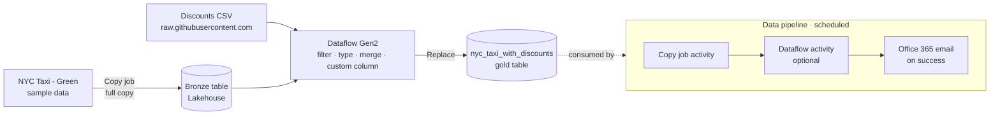
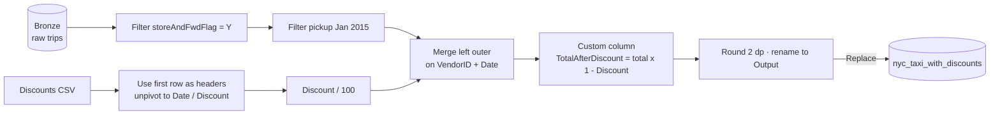

# Data Factory tutorial

[Official docs](https://learn.microsoft.com/en-us/fabric/data-factory/tutorial-end-to-end-introduction)

**Data Factory in Microsoft Fabric** is the low-code data integration experience — it combines the ease of **Power Query** with the scale of **Azure Data Factory** for ingestion, transformation, and orchestration. In this tutorial you ingest the **NYC Taxi – Green** sample data into a lakehouse **bronze** table with a **Copy job**, enrich it into a **gold** table with a **Dataflow Gen2**, then orchestrate the whole flow with a **pipeline** that emails a notification and runs on a schedule — a complete data-integration scenario in about an hour.

**Status:** 🟡 In progress · **Started:** 2026-07-22

!!! note "Git integration in this repo"
    The Data Factory workspace is Git-connected, targeting the `git/end-to-end/data-factory` folder in
    **this** repo (see `git/README.md`). Committing from the workspace syncs its item definitions
    (Copy job, Lakehouse, Dataflow Gen2, Data pipeline) there to keep a trace.

!!! info "Scope"
    Foundational walkthrough of how the three Data Factory building blocks (Copy job → dataflow → pipeline) fit together in a medallion flow. It is *not* a reference architecture, an exhaustive feature list, or a set of best-practice recommendations.

## Why Data Factory?

Most analytics scenarios start with the same problem: raw data lives *somewhere else* and has to be **moved, cleaned, and kept up to date**. Data Factory covers that end-to-end without stitching together separate services — **Copy job** for petabyte-scale ingestion (bulk, incremental, or CDC) with no pipeline to build, **Dataflow Gen2** for low-code transformation with 300+ Power Query transforms, and **pipelines** to orchestrate, notify, and schedule the whole thing. This lab wires all three into a single medallion flow.

## Key concepts

| Term | What it means |
| --- | --- |
| **Copy job** | The recommended starting point for ingestion — moves data from hundreds of sources into a destination (bulk / incremental / CDC) **without** building a pipeline. |
| **Dataflow Gen2** | Low-code transformation built on **Power Query**; 300+ transforms, authored visually, loaded to one or more destinations. |
| **Power Query / M** | The transformation engine and formula language behind dataflows; each transform is an **applied step**. |
| **Data pipeline** | Orchestrator that chains **activities** (Copy job, dataflow, notebook, email, …) to run in sequence or parallel, with monitoring. |
| **Office 365 Outlook activity** | Pipeline activity that sends an email notification (requires an **enterprise** account — personal email isn't supported). |
| **Lakehouse** | OneLake-backed store holding the **bronze** (raw) and **gold** (enriched) Delta tables the flow writes to. |
| **Medallion (bronze → gold)** | Data-quality tiers — **bronze** = raw ingested, **gold** = cleaned/enriched and ready for consumption. |

## Architecture

The flow spans three stages: **ingest** raw data to a bronze table, **transform** and enrich it into a gold table, then **orchestrate & automate** the run with a scheduled, notifying pipeline. All tables land in a Lakehouse in **OneLake**.

| Stage | What happens |
| --- | --- |
| **Ingest** | A **Copy job** loads the NYC Taxi – Green sample data into a Lakehouse **`Bronze`** table (full copy). |
| **Transform** | A **Dataflow Gen2** reads `Bronze`, filters/typecasts it, merges a **discounts CSV**, computes `TotalAfterDiscount`, and writes the gold **`nyc_taxi_with_discounts`** table. |
| **Orchestrate & automate** | A **pipeline** runs the Copy job (and optionally the dataflow), sends an **Office 365** email on success, and runs on a **schedule**. |

## What you build

Prerequisite: a **[workspace](https://learn.microsoft.com/en-us/fabric/fundamentals/create-workspaces)** on a Fabric-enabled **capacity**, access to [Power BI](https://msit.powerbi.com/home), and an **enterprise email** account for the notification step. The tutorial is an introduction plus three modules; the **module numbers below match the Learn nav** and are reused across this page (tech table and section headings).

| # | Step | Outcome |
| --- | --- | --- |
| — | **[Introduction](https://learn.microsoft.com/en-us/fabric/data-factory/tutorial-end-to-end-introduction)** | Scenario, dataset & architecture (this page) |
| 1 | **[Ingest data with a Copy job](https://learn.microsoft.com/en-us/fabric/data-factory/tutorial-end-to-end-pipeline)** | Copy job loads NYC Taxi – Green sample data into a Lakehouse **`Bronze`** table |
| 2 | **[Transform data with a dataflow](https://learn.microsoft.com/en-us/fabric/data-factory/tutorial-end-to-end-dataflow)** | Dataflow Gen2 enriches `Bronze` + a discounts CSV into the gold **`nyc_taxi_with_discounts`** table |
| 3 | **[Orchestrate and automate with a pipeline](https://learn.microsoft.com/en-us/fabric/data-factory/tutorial-end-to-end-integration)** | Pipeline runs the Copy job (+ optional dataflow), sends an email on success, and is scheduled |

!!! note "Alternative pipeline lab"
    For a hands-on pipeline walkthrough outside this end-to-end tutorial, see the **mslearn-fabric** lab
    [Ingest data with a pipeline in Microsoft Fabric](https://microsoftlearning.github.io/mslearn-fabric/Instructions/Labs/04-ingest-pipeline.html) —
    it builds a **Data pipeline** with a **Copy Data** activity and a **notebook** activity to load and transform data in a lakehouse.

## Sample dataset

The tutorial uses the built-in **NYC Taxi – Green** sample data — green-taxi trip records with pickup/dropoff timestamps and coordinates, passenger count, trip distance, vendor ID, and fare/total amount. A second source, a **generated discounts CSV** (`Generated-NYC-Taxi-Green-Discounts.csv`), lists a discount per **VendorID** per day. Merging the two lets you compute a discounted total and, ultimately, **analyze daily discounts on taxi fares** for a chosen period (the lab filters to January 2015).

## Data and transformation flow

Raw trips land in `Bronze`, get filtered and typed, then are merged with the unpivoted discount rows to produce a per-trip discounted total in the gold table.

## Technologies & services by step

Reference of the Fabric item used at each module — handy when working out how to reuse a given building block later.

| Step | Fabric item / service | Technology | Key details |
| --- | --- | --- | --- |
| 1 · Ingest | **Copy job** → **Lakehouse** | Copy assistant · Delta | Choose **Sample data → NYC Taxi – Green**, destination **Lakehouse**, **Full copy**, map to a **`Bronze`** table with **Append**. The full copy can take **30+ minutes**. |
| 2 · Transform | **Dataflow Gen2** | Power Query / M | Get data from the `Bronze` Lakehouse table; type/filter columns; add the discounts **Text/CSV** source (anonymous); unpivot + divide by 100; **merge** (left outer) on VendorID + Date; custom column `TotalAfterDiscount`; write the **`nyc_taxi_with_discounts`** table (**Replace**). First dataflow in a workspace provisions hidden **`DataflowsStaging`** items. |
| 3 · Orchestrate | **Data pipeline** + **Office 365 Outlook** | Activities · expressions · scheduler | Add a **Copy job** activity; connect **On success** to an **Office 365 Email** activity (enterprise account only) with `@concat(...)` expressions for subject/body; optionally insert the **Dataflow** activity between them; **Schedule** the pipeline (e.g. daily 8:00 PM). |

## Notes

-

## Key takeaways

-

*Curated from [Microsoft Learn](https://learn.microsoft.com/en-us/fabric/data-factory/tutorial-end-to-end-introduction) · Updated 2026-04-13*
