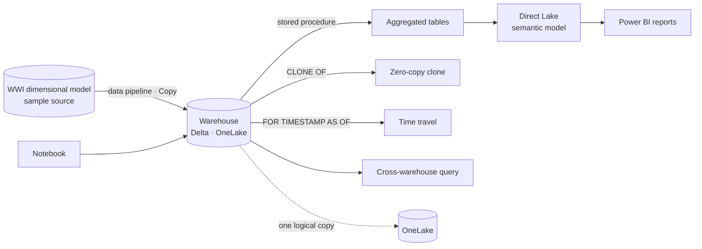

# Data warehouse tutorial

[Official docs](https://learn.microsoft.com/en-us/fabric/data-warehouse/tutorial-introduction)

A **Fabric Warehouse** is a fully managed, T-SQL data warehouse that stores data as **Delta Lake** in **OneLake**. In this tutorial you take the role of a warehouse developer at the fictional **Wide World Importers (WWI)** company: you ingest the WWI dimensional model with a **pipeline**, transform it with **T-SQL** (clone, stored procedures, time travel), query it with the visual and SQL editors and a notebook, then build a **Direct Lake** semantic model and Power BI reports over the data in place.

**Status:** 🟡 In progress · **Started:** 2026-07-13

!!! note "Git integration in this repo"
    The Warehouse workspace is Git-connected, targeting the `git/end-to-end/data-warehouse` folder in
    **this** repo (see `git/README.md`). Committing from the workspace syncs its item definitions
    (warehouse, data pipeline, semantic model, Power BI report, notebook) there to keep a trace.

!!! info "Scope"
    Foundational walkthrough of the Fabric warehouse experience (ingest → transform with T-SQL → query → model → report). It is *not* a reference architecture, an exhaustive feature list, or a set of best-practice recommendations.

## Why a Fabric Warehouse?

A Fabric Warehouse gives data professionals a familiar **T-SQL** surface for building and serving a dimensional model, but on the open **Delta Lake / OneLake** foundation shared by every Fabric engine — so there's **no data duplication** between warehouse, lakehouse, and Power BI. You get transactional T-SQL (DDL/DML), zero-copy **cloning**, **time travel**, cross-warehouse queries, and **Direct Lake** reporting that reads the Delta files directly, all without moving or copying data.

## Key concepts

| Term | What it means |
| --- | --- |
| **Warehouse** | Fully managed **T-SQL** data warehouse; data is stored as **Delta Lake** tables in OneLake. |
| **SQL analytics endpoint** | Read-only T-SQL endpoint auto-created over a lakehouse/warehouse for querying and reporting. |
| **Data pipeline** | No-code orchestration with a **Copy** activity to ingest data into the warehouse. |
| **Dimensional model / star schema** | Central **fact** table (`fact_sale`) surrounded by **dimension** tables. |
| **Stored procedure** | T-SQL routine that transforms data — here to build aggregated datasets. |
| **Table clone** | **Zero-copy** clone of a table via `CREATE TABLE … AS CLONE OF` (current or past point in time). |
| **Time travel** | Query data **as it existed at a past timestamp** (within the retention window) with `OPTION (FOR TIMESTAMP AS OF …)`. |
| **Visual query editor** | No-code, drag-and-drop query builder that generates T-SQL. |
| **Cross-warehouse query** | A single T-SQL query that joins across multiple warehouses / SQL analytics endpoints. |
| **Direct Lake** | Semantic model mode that reads Delta tables **directly from OneLake** — no import, no DirectQuery. |
| **OneLake catalog (data hub)** | Discover data across the tenant and auto-generate reports from it. |

## Architecture

Source data is ingested into the warehouse with a pipeline, transformed and served with T-SQL, then consumed in Power BI via a Direct Lake semantic model — all on Delta Lake in **OneLake**.

| Stage | What happens |
| --- | --- |
| **Data sources** | The **WWI dimensional model** is the sample source (normally you'd stage from transactional systems). |
| **Ingestion** | A **data pipeline** (Copy activity) loads the dimensional model into the warehouse; **shortcuts** can connect data without copying. |
| **Transform & store** | **T-SQL** (clones, stored procedures, time travel) shapes the data; everything is stored as **Delta Lake** in OneLake. |
| **Consume** | A **Direct Lake** semantic model + **Power BI** reports analyze the star schema in place; a built-in **TDS endpoint** serves other tools. |

## What you build

Prerequisite: a Power BI account and **Microsoft Fabric enabled** in the tenant. The steps below mirror the Learn tutorial nav (1–12), and these **step numbers are used consistently across this page** (tech table below).

| # | Step | Outcome |
| --- | --- | --- |
| — | **[Introduction](https://learn.microsoft.com/en-us/fabric/data-warehouse/tutorial-introduction)** | Overview, scenario, architecture & data model (this page) |
| 1 | **[Create a workspace](https://learn.microsoft.com/en-us/fabric/data-warehouse/tutorial-create-workspace)** | A Fabric workspace on a Fabric-enabled capacity |
| 2 | **[Create a Warehouse](https://learn.microsoft.com/en-us/fabric/data-warehouse/tutorial-create-warehouse)** | An empty Fabric Warehouse |
| 3 | **[Ingest data](https://learn.microsoft.com/en-us/fabric/data-warehouse/tutorial-ingest-data)** | A data pipeline (Copy) loads the WWI dimensional model |
| 4 | **[Clone a table with T-SQL](https://learn.microsoft.com/en-us/fabric/data-warehouse/tutorial-clone-table)** | Zero-copy clone of a table via `CREATE TABLE … AS CLONE OF` |
| 5 | **[Transform data with a stored procedure](https://learn.microsoft.com/en-us/fabric/data-warehouse/tutorial-transform-data)** | Stored procedure builds aggregated datasets |
| 6 | **[Time travel with T-SQL](https://learn.microsoft.com/en-us/fabric/data-warehouse/tutorial-time-travel)** | Query data as it appeared at a past point in time |
| 7 | **[Create a query with the visual query editor](https://learn.microsoft.com/en-us/fabric/data-warehouse/tutorial-visual-query)** | No-code visual query over the warehouse |
| 8 | **[Analyze data in a notebook](https://learn.microsoft.com/en-us/fabric/data-warehouse/tutorial-analyze-data-notebook)** | Explore warehouse data in a notebook |
| 9 | **[Cross-warehouse query](https://learn.microsoft.com/en-us/fabric/data-warehouse/tutorial-sql-cross-warehouse-query-editor)** | Query across warehouses in the SQL query editor |
| 10 | **[Direct Lake semantic model & Power BI report](https://learn.microsoft.com/en-us/fabric/data-warehouse/tutorial-power-bi-report)** | Build a Direct Lake model and report in place |
| 11 | **[Generate a report from OneLake catalog](https://learn.microsoft.com/en-us/fabric/data-warehouse/tutorial-build-report-onelake-data-hub)** | Auto-create a report from the data hub |
| 12 | **[Clean up resources](https://learn.microsoft.com/en-us/fabric/data-warehouse/tutorial-clean-up)** | Workspace and items deleted |

## Sample dataset

The tutorial uses the **Wide World Importers (WWI)** sample — a wholesale novelty-goods importer/distributor. It's a **star schema** centred on the **`fact_sale`** table with related **dimension** tables (customer, item, date, and so on). Rather than staging from a transactional system, the tutorial uses WWI's **dimensional model directly** as the source, ingests it into the warehouse, and transforms it with T-SQL.

## Technologies & services by step

Reference of the Fabric technology used at each stage — handy when working out how to integrate or reuse a given service later.

| Step | Fabric item / service | Technology | Key details |
| --- | --- | --- | --- |
| 1 · Create a workspace | **Workspace** | Fabric capacity | Container for all tutorial items; must be on a Fabric-enabled capacity. |
| 2 · Create a Warehouse | **Warehouse** | T-SQL · Delta / OneLake | Fully managed T-SQL warehouse; tables stored as Delta in OneLake. |
| 3 · Ingest data | **Data pipeline** | Copy activity · no-code | Loads the WWI dimensional model into the warehouse. |
| 4 · Clone a table | **Warehouse** | T-SQL `CREATE TABLE … AS CLONE OF` | Zero-copy metadata clone, at current or past point in time. |
| 5 · Transform data | **Stored procedure** | T-SQL | Builds aggregated datasets from `fact_sale` + dimensions. |
| 6 · Time travel | **Warehouse** | T-SQL `OPTION (FOR TIMESTAMP AS OF …)` | Query historical data state within the retention window. |
| 7 · Visual query | **Visual query editor** | No-code / drag-drop | Build queries visually; generates T-SQL underneath. |
| 8 · Analyze in a notebook | **Notebook** | Spark / T-SQL | Explore warehouse data programmatically. |
| 9 · Cross-warehouse query | **SQL query editor** | T-SQL | Join across multiple warehouses / SQL analytics endpoints in one query. |
| 10 · Semantic model & report | **Semantic model** + **Power BI** | Direct Lake | Reads Delta directly from OneLake; build the report in place. |
| 11 · Report from OneLake catalog | **OneLake catalog** | Auto-create report | Generate a report from the data hub. |
| 12 · Clean up | **Workspace** | — | Delete the workspace and all items to release capacity. |

## Notes

-

## Key takeaways

-

*Curated from [Microsoft Learn](https://learn.microsoft.com/en-us/fabric/data-warehouse/tutorial-introduction) · Updated 2025-08-22*
