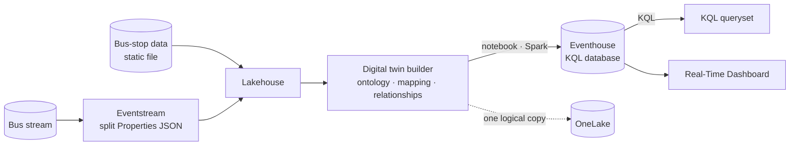

# Digital twin builder in Real-Time Intelligence tutorial

[Official docs](https://learn.microsoft.com/en-us/fabric/real-time-intelligence/digital-twin-builder/tutorial-rti-0-introduction)

**Digital twin builder (DTB, preview)** is a Real-Time Intelligence item that creates digital representations of real-world environments — modelling assets and processes as an **ontology**. In this tutorial you contextualize a streamed **London bus** feed against static bus-stop data, build an ontology, project it to an Eventhouse via a notebook, then query with **KQL** and visualize in a **Real-Time Dashboard** to analyze bus delays by stop and borough.

**Status:** 🟡 In progress · **Started:** 2026-07-09

!!! warning "Preview — tenant settings required first"
    Digital twin builder is in **preview**. Before starting, a **tenant admin** must enable **Digital Twin Builder (preview)** in **Admin portal → Tenant settings**. The tenant must **not** have **Autoscale Billing for Spark** enabled — DTB is incompatible with it.

!!! note "Git integration in this repo"
    The DTB workspace is Git-connected, targeting the `git/end-to-end/digital-twin-builder-rti` folder in
    **this** repo (see `git/README.md`). Committing from the workspace syncs its item definitions
    (digital twin builder, lakehouse, eventstream, eventhouse/KQL database, notebook, KQL queryset, Real-Time Dashboard) there to keep a trace.

!!! info "Scope"
    Foundational walkthrough of how DTB fits into the RTI stack (model → map → contextualize → project → analyze). It is *not* a reference architecture, an exhaustive feature list, or a set of best-practice recommendations.

## Why digital twin builder?

Raw IT/OT data is siloed and lacks shared meaning. DTB gives operational decision-makers a **low-code/no-code** way to standardize disparate sources into a common **ontology** — modelling business concepts (assets, processes) and the **relationships** between them — so the data reflects the physical world and can be explored, queried, and visualized. Data lands in **OneLake**, so other Fabric experiences (KQL, Power BI, Activator, data agents, ML) can consume it.

## Key concepts

| Term | What it means |
| --- | --- |
| **Digital twin builder (preview)** | RTI item that builds digital representations of real-world environments from data. *(Different from Azure Digital Twins.)* |
| **Ontology** | The shared vocabulary + structure — a digital replica of assets, processes, or environments. |
| **Entity type** | A concept in your operations (e.g. **Bus**, **BusStop**); source data is mapped to instances of it. |
| **Mapping** | Harmonizing disparate source data into the ontology by binding columns to entity-type properties. |
| **Semantic relationship** | A typed link between entity types (e.g. a bus *stops at* a bus stop) — adds **contextualization**. |
| **Semantic canvas** | The modelling surface where you build entity types, mappings, and relationships. |
| **Explorer** | Built-in exploration views — card view of assets, time-series charts, keyword/advanced search. |
| **Ontology extensions** | Connect the ontology to Real-Time Dashboards, Power BI, Activator, data agents, or ML. |

## The three modelling stages

DTB builds an ontology in three stages (this is the core loop of step 3):

| Stage | What you do |
| --- | --- |
| 🧩 **Ontology modelling** | Design the shared vocabulary/structure — the entity types that represent your physical world. |
| 🔗 **Ontology mapping** | Map data from different source systems onto instances of those entity types. |
| 🌐 **Contextualization** | Add semantic **relationship types** between entity types to reflect real-world dependencies. |

## Architecture

Static and streaming data are prepared in a lakehouse, modelled into an ontology in DTB, projected to an Eventhouse, then queried and visualized. Everything lives in **OneLake**.

| Stage | What happens |
| --- | --- |
| **Contextual data** | Static **bus-stop** dimensional data uploaded as a file to a **lakehouse**. |
| **Streaming data** | Real-time **bus** events flow via an **eventstream**; the JSON `Properties` field is split into usable columns and landed in the lakehouse. |
| **Model** | Build the **ontology** in DTB — entity types for bus/trip and bus stop, mappings, and relationships. |
| **Project** | A **Fabric notebook** (Spark) projects the ontology data into an **Eventhouse** (as one logical copy in OneLake). |
| **Analyze** | **KQL** queries + a **Real-Time Dashboard** surface delay patterns by stop and borough. |

## What you build

Prerequisite: a **[workspace](https://learn.microsoft.com/en-us/fabric/fundamentals/create-workspaces)** on a Fabric-enabled **capacity**, with **Digital Twin Builder (preview)** enabled and **Autoscale Billing for Spark disabled**. The steps below mirror the Learn tutorial nav (1–6), and these **step numbers are used consistently across this page** (tech table below).

| # | Step | Outcome |
| --- | --- | --- |
| — | **[Introduction](https://learn.microsoft.com/en-us/fabric/real-time-intelligence/digital-twin-builder/tutorial-rti-0-introduction)** | Overview, scenario & architecture (this page) |
| 1 | **[Upload contextual data](https://learn.microsoft.com/en-us/fabric/real-time-intelligence/digital-twin-builder/tutorial-rti-1-upload-contextual-data)** | Static bus-stop data uploaded to a lakehouse |
| 2 | **[Get and process streaming data](https://learn.microsoft.com/en-us/fabric/real-time-intelligence/digital-twin-builder/tutorial-rti-2-get-streaming-data)** | Bus stream ingested via eventstream, `Properties` JSON split, landed in the lakehouse |
| 3 | **[Build the ontology](https://learn.microsoft.com/en-us/fabric/real-time-intelligence/digital-twin-builder/tutorial-rti-3-build-ontology)** | Entity types, mappings, and semantic relationships in DTB |
| 4 | **[Project to eventhouse](https://learn.microsoft.com/en-us/fabric/real-time-intelligence/digital-twin-builder/tutorial-rti-4-project-eventhouse)** | Notebook projects ontology data into an Eventhouse |
| 5 | **[Query and visualize data](https://learn.microsoft.com/en-us/fabric/real-time-intelligence/digital-twin-builder/tutorial-rti-5-query-and-visualize)** | KQL queries + Real-Time Dashboard over the projected data |
| 6 | **[Clean up resources](https://learn.microsoft.com/en-us/fabric/real-time-intelligence/digital-twin-builder/tutorial-rti-6-clean-up-resources)** | Workspace and items deleted |

## Sample dataset

The scenario combines two sources to analyze whether buses run late and where delays cluster:

- **Bus data (fact, streaming)** — real-time bus movements: `Timestamp`, `TripId`, `BusLine`, `StationNumber`, `ScheduleTime`, and a JSON `Properties` field holding `BusState` (`InMotion`/`Arrived`) and `TimeToNextStation`. The `Properties` JSON must be **split into columns** before use in DTB.
- **Bus-stop data (dimension, static)** — contextual stop info uploaded to the lakehouse: `Stop_Code`, `Stop_Name`, `Latitude`, `Longitude`, `Road_Name`, `Borough`, `Borough_ID`, `Suggested_Locality`, `Locality_ID` — enabling stop-, road-, and borough-level analysis.

## Technologies & services by step

Reference of the Fabric technology used at each stage — handy when working out how to integrate or reuse a given service later.

| Step | Fabric item / service | Technology | Key details |
| --- | --- | --- | --- |
| 1 · Upload contextual data | **Lakehouse** | OneLake · file upload | Static bus-stop dimensional file uploaded as the contextual source for the ontology. |
| 2 · Get & process streaming data | **Eventstream** + **Lakehouse** | No-code streaming | Bus stream ingested; the JSON `Properties` field is **split** into `BusState`/`TimeToNextStation` columns, then landed in the lakehouse. |
| 3 · Build the ontology | **Digital twin builder** (preview) | Semantic canvas · ontology | Model **entity types**, **map** lakehouse data to them, and add **semantic relationships** (contextualization). |
| 4 · Project to eventhouse | **Notebook** + **Eventhouse** | Spark · KQL database | A Fabric notebook projects ontology data into the Eventhouse (one logical copy in OneLake) for fast querying. |
| 5 · Query & visualize | **KQL queryset** + **Real-Time Dashboard** | Kusto Query Language | Query the projected data and build dashboard tiles — delays by stop and borough. |
| 6 · Clean up | **Workspace** | — | Delete the workspace and all items to release capacity. |

## Notes

-

## Key takeaways

-

*Curated from [Microsoft Learn](https://learn.microsoft.com/en-us/fabric/real-time-intelligence/digital-twin-builder/tutorial-rti-0-introduction) · Updated 2025-11-10*
