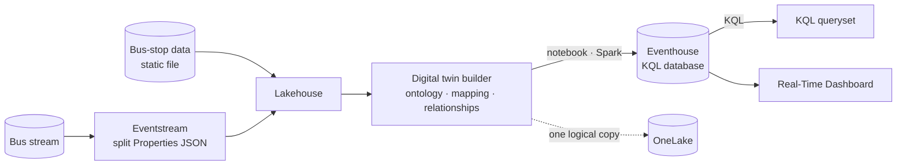
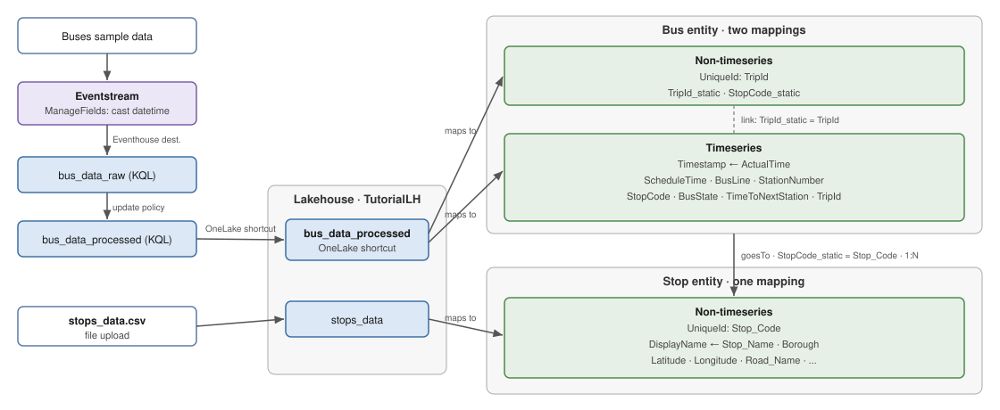

# Digital twin builder in Real-Time Intelligence tutorial

[Official docs](https://learn.microsoft.com/en-us/fabric/real-time-intelligence/digital-twin-builder/tutorial-rti-0-introduction)

**Digital twin builder (DTB, preview)** is a Real-Time Intelligence item that creates digital representations of real-world environments — modelling assets and processes as an **ontology**. In this tutorial you contextualize a streamed **London bus** feed against static bus-stop data, build an ontology, project it to an Eventhouse via a notebook, then query with **KQL** and visualize in a **Real-Time Dashboard** to analyze bus delays by stop and borough.

**Status:** ⏸️ Paused (blocked at step 4) · **Started:** 2026-07-09

!!! warning "Preview — tenant settings required first"
    Digital twin builder is in **preview**. Before starting, a **tenant admin** must enable **Users can create Digital Twin Builder (preview) items** in **Admin portal → Tenant settings**. The tenant must **not** have **Autoscale Billing for Spark** enabled — DTB is incompatible with it.

!!! note "Git integration in this repo"
    The DTB workspace is Git-connected, targeting the `git/end-to-end/digital-twin-builder-rti` folder in
    **this** repo (see `git/README.md`). Committing from the workspace syncs its item definitions
    (digital twin builder, lakehouse, eventstream, eventhouse/KQL database, notebook, KQL queryset, Real-Time Dashboard) there to keep a trace.

!!! info "Scope"
    Foundational walkthrough of how DTB fits into the RTI stack (model → map → contextualize → project → analyze). It is *not* a reference architecture, an exhaustive feature list, or a set of best-practice recommendations.

## Why digital twin builder?

Raw IT/OT data is siloed and lacks shared meaning. DTB gives operational decision-makers a **low-code/no-code** way to standardize disparate sources into a common **ontology** — modelling business concepts (assets, processes) and the **relationships** between them — so the data reflects the physical world and can be explored, queried, and visualized. Data lands in **OneLake**, so other Fabric experiences (KQL, Power BI, Activator, data agents, ML) can consume it.

## Key concepts

| Term | What it means |
| --- | --- |
| **Digital twin builder (preview)** | RTI item that builds digital representations of real-world environments from data. *(Different from Azure Digital Twins.)* |
| **Ontology** | The shared vocabulary + structure — a digital replica of assets, processes, or environments. |
| **Entity type** | A concept in your operations (e.g. **Bus**, **BusStop**); source data is mapped to instances of it. |
| **Mapping** | Harmonizing disparate source data into the ontology by binding columns to entity-type properties. |
| **Semantic relationship** | A typed link between entity types (e.g. a bus *stops at* a bus stop) — adds **contextualization**. |
| **Semantic canvas** | The modelling surface where you build entity types, mappings, and relationships. |
| **Explorer** | Built-in exploration views — card view of assets, time-series charts, keyword/advanced search. |
| **Ontology extensions** | Connect the ontology to Real-Time Dashboards, Power BI, Activator, data agents, or ML. |

## The three modelling stages

DTB builds an ontology in three stages (this is the core loop of step 3):

| Stage | What you do |
| --- | --- |
| 🧩 **Ontology modelling** | Design the shared vocabulary/structure — the entity types that represent your physical world. |
| 🔗 **Ontology mapping** | Map data from different source systems onto instances of those entity types. |
| 🌐 **Contextualization** | Add semantic **relationship types** between entity types to reflect real-world dependencies. |

## Architecture

Static and streaming data are prepared in a lakehouse, modelled into an ontology in DTB, projected to an Eventhouse, then queried and visualized. Everything lives in **OneLake**.

| Stage | What happens |
| --- | --- |
| **Contextual data** | Static **bus-stop** dimensional data uploaded as a file to a **lakehouse**. |
| **Streaming data** | Real-time **bus** events flow via an **eventstream**; the JSON `Properties` field is split into usable columns and landed in the lakehouse. |
| **Model** | Build the **ontology** in DTB — entity types for bus/trip and bus stop, mappings, and relationships. |
| **Project** | A **Fabric notebook** (Spark) projects the ontology data into an **Eventhouse** (as one logical copy in OneLake). |
| **Analyze** | **KQL** queries + a **Real-Time Dashboard** surface delay patterns by stop and borough. |

## What you build

Prerequisite: a **[workspace](https://learn.microsoft.com/en-us/fabric/fundamentals/create-workspaces)** on a Fabric-enabled **capacity**, with **Digital Twin Builder (preview)** enabled and **Autoscale Billing for Spark disabled**. The steps below mirror the Learn tutorial nav (1–6), and these **step numbers are used consistently across this page** (tech table below).

| # | Step | Outcome |
| --- | --- | --- |
| — | **[Introduction](https://learn.microsoft.com/en-us/fabric/real-time-intelligence/digital-twin-builder/tutorial-rti-0-introduction)** | Overview, scenario & architecture (this page) |
| 1 | **[Upload contextual data](https://learn.microsoft.com/en-us/fabric/real-time-intelligence/digital-twin-builder/tutorial-rti-1-upload-contextual-data)** | Static bus-stop data uploaded to a lakehouse |
| 2 | **[Get and process streaming data](https://learn.microsoft.com/en-us/fabric/real-time-intelligence/digital-twin-builder/tutorial-rti-2-get-streaming-data)** | Bus stream ingested via eventstream, `Properties` JSON split, landed in the lakehouse |
| 3 | **[Build the ontology](https://learn.microsoft.com/en-us/fabric/real-time-intelligence/digital-twin-builder/tutorial-rti-3-build-ontology)** | Entity types, mappings, and semantic relationships in DTB |
| 4 | **[Project to eventhouse](https://learn.microsoft.com/en-us/fabric/real-time-intelligence/digital-twin-builder/tutorial-rti-4-project-eventhouse)** | Notebook projects ontology data into an Eventhouse |
| 5 | **[Query and visualize data](https://learn.microsoft.com/en-us/fabric/real-time-intelligence/digital-twin-builder/tutorial-rti-5-query-and-visualize)** | KQL queries + Real-Time Dashboard over the projected data |
| 6 | **[Clean up resources](https://learn.microsoft.com/en-us/fabric/real-time-intelligence/digital-twin-builder/tutorial-rti-6-clean-up-resources)** | Workspace and items deleted |

## Sample dataset

The scenario combines two sources to analyze whether buses run late and where delays cluster:

- **Bus data (fact, streaming)** — real-time bus movements: `Timestamp`, `TripId`, `BusLine`, `StationNumber`, `ScheduleTime`, and a JSON `Properties` field holding `BusState` (`InMotion`/`Arrived`) and `TimeToNextStation`. The `Properties` JSON must be **split into columns** before use in DTB.
- **Bus-stop data (dimension, static)** — contextual stop info uploaded to the lakehouse: `Stop_Code`, `Stop_Name`, `Latitude`, `Longitude`, `Road_Name`, `Borough`, `Borough_ID`, `Suggested_Locality`, `Locality_ID` — enabling stop-, road-, and borough-level analysis.

## Technologies & services by step

Reference of the Fabric technology used at each stage — handy when working out how to integrate or reuse a given service later.

| Step | Fabric item / service | Technology | Key details |
| --- | --- | --- | --- |
| 1 · Upload contextual data | **Lakehouse** | OneLake · file upload | Static bus-stop dimensional file uploaded as the contextual source for the ontology. |
| 2 · Get & process streaming data | **Eventstream** + **Lakehouse** | No-code streaming | Bus stream ingested; the JSON `Properties` field is **split** into `BusState`/`TimeToNextStation` columns, then landed in the lakehouse. |
| 3 · Build the ontology | **Digital twin builder** (preview) | Semantic canvas · ontology | Model **entity types**, **map** lakehouse data to them, and add **semantic relationships** (contextualization). |
| 4 · Project to eventhouse | **Notebook** + **Eventhouse** | Spark · KQL database | A Fabric notebook projects ontology data into the Eventhouse (one logical copy in OneLake) for fast querying. |
| 5 · Query & visualize | **KQL queryset** + **Real-Time Dashboard** | Kusto Query Language | Query the projected data and build dashboard tiles — delays by stop and borough. |
| 6 · Clean up | **Workspace** | — | Delete the workspace and all items to release capacity. |

??? info "Kusto update policy (used in step 2)"
    A **[Kusto update policy](https://learn.microsoft.com/en-us/kusto/management/update-policy?view=microsoft-fabric)** is an automation that fires **when new data lands in a source table**: it runs a query to transform the incoming rows and writes the result to a **target table** — no separate orchestration needed. The target can have its own schema and policies. In this tutorial ([step 2](https://learn.microsoft.com/en-us/fabric/real-time-intelligence/digital-twin-builder/tutorial-rti-2-get-streaming-data#transform-the-data-using-update-policies)) it turns raw stream rows (`bus_data_raw`) into the DTB-ready table (`bus_data_processed`) by splitting the JSON `Properties` field and adding the synthetic `StopCode` join key.

    | Property | Meaning |
    | --- | --- |
    | **`Source`** | Table whose ingestion **triggers** the policy (`bus_data_raw`). |
    | **`Query`** | Function that transforms the new rows (`extractBusData`). |
    | **`IsTransactional`** | If `true`, a failed transform blocks ingestion so source and target stay consistent (set `true` in production). |
    | **`PropagateIngestionProperties`** | Carries ingestion metadata (extent tags, creation time) to the target. |

    !!! tip "Why it matters here"
        It's the pattern for **in-database ETL at ingestion time** — reshape/enrich streaming data the moment it arrives, keeping a raw landing table and a clean, queryable table side by side.

## Step 3 deep dive — ontology data mapping

The mapping model in DTB is the trickiest part of step 3. Each **entity type** is hydrated from one or more lakehouse tables via two kinds of mapping, and they must be linked correctly.

| Mapping kind | What it holds | Rules |
| --- | --- | --- |
| **Non-timeseries** (static) | The entity's **identity** + slowly-changing attributes. | Requires a **Unique Id** (one or more source columns) that identifies each entity instance. **Map at least one non-timeseries property first** — before any timeseries. |
| **Timeseries** | The streaming **measurements over time** (location, status, delay). | Requires a **Timestamp** property (must be a real `datetime`). **Linked** to instances by matching a non-timeseries property to a timeseries column — values must match **exactly**. |

### Bus entity (fact — has both mapping kinds)

Source: `bus_data_processed`. Unique Id: `TripId`.

| Mapping | Timestamp | Mapped properties | Link |
| --- | --- | --- | --- |
| **Non-timeseries** | — | `TripId_static` (from `TripId`), `StopCode_static` (from `StopCode`); `DisplayName` left unmapped | — |
| **Timeseries** | `ActualTime` → `Timestamp` | `ScheduleTime`, `BusLine`, `StationNumber`, `StopCode`, `BusState`, `TimeToNextStation`, `TripId`; incremental mapping **on** | `TripId_static` **=** timeseries `TripId` |

!!! note "Why the `_static` suffix"
    `TripId` is mapped **twice** — once as the static identity (`TripId_static`) and once as a timeseries column (`TripId`). The static copy is renamed to avoid a name clash, and it's the property used to **link** the two mappings together.

### Stop entity (dimension — non-timeseries only)

Source: `stops_data`. Unique Id: `Stop_Code`. No streaming data.

| Mapping | Mapped properties |
| --- | --- |
| **Non-timeseries** | `Stop_Name` → `DisplayName`; plus `Stop_Code`, `Road_Name`, `Borough`, `Borough_ID`, `Suggested_Locality`, `Locality_ID`, `Latitude`, `Longitude` |

### Relationship

**Bus `goesTo` Stop** — join `Bus.StopCode_static` **=** `Stop.Stop_Code`, type **Many Stop per Bus (1:N)** (bus-centric; the real relationship is many-to-many).

### End-to-end data lineage (stream → lakehouse → ontology)

How each source actually reaches the ontology. The two branches differ: the **bus** stream takes a detour through an Eventhouse, while the **stop** data is a simple file upload.

- **Eventstream ≠ storage.** The eventstream is the transport/transform pipe; data must land in a **destination**. Here that's the **Eventhouse KQL database** (`bus_data_raw`), *not* the lakehouse directly.
- **Why the Eventhouse first.** You need **KQL** (the update policy) to split the JSON `Properties` and add the synthetic `StopCode` — DTB can't do those transforms itself.
- **The lakehouse copy is a shortcut, not a copy.** `bus_data_processed` is made **OneLake-available**, then a **shortcut** surfaces it in `TutorialLH` — one physical copy in OneLake, two views. DTB requires a **lakehouse** source, hence the shortcut.

*The **Bus** and **Stop** entities plus the `goesTo` relationship together form the **ontology** in DTB.*

!!! warning "What makes this hard to reproduce for real"
    To repeat this pattern on your own data you need **four** things lined up: (1) a stable **Unique Id** per entity in the source; (2) a genuine **`datetime` Timestamp** column for the timeseries (the `ScheduleTime`/`ActualTime` casting exists for this); (3) a non-timeseries **link column whose values exactly match** a timeseries column; and (4) a **shared join key** between the two entities' sources — which this lab fabricates as `StopCode`.

## Notes

- **⏸️ Paused at step 4 — Eventhouse projection blocked.** Creating the projection functions fails with `$$ENSURE[ArgIsNotNull]: Argument 'authorizationHelper' is null` at `ApplyOneLakeSecurityRestrictionsIfNeeded` — an internal engine null-ref in the Eventhouse OneLake-security path when resolving the `TutorialDTBdtdm` external-table shortcuts. Reproduces identically via the notebook REST cell **and** interactively in the query editor, at create-time. Setup was verified correct: all shortcuts present, names case-correct (`Tutorial` / `TutorialDTB`), and every item in one workspace/capacity. `skipvalidation=true` only bypasses create-time validation (a diagnostic, not a fix). Treating as a **preview service issue** — to resume: retry after a wait, and if it persists raise support with the failing `OperationId`.
- **The bus→stop join key is synthetic (lab-specific hack).** The stream has no stop identity; step 2 derives `StopCode` from `BusLine` + `StationNumber` purely so the fact data has a column that matches `Stop_Code` in the static stop dimension. In the real world the sources would already share a common key.
- **`Bus goesTo Stop` is modelled 1:N (Many Stop per Bus).** Bus-centric — one trip fans out to the many stops it visits, so bus events resolve to stop context. The real relationship is many-to-many (a stop is also served by many buses); *Many Bus per Stop* would model the inverse, stop-centric view.
- **Shortcut batch limit: 10.** When shortcutting the `TutorialDTBdtdm` tables into the KQL database (step 4), only **10 shortcuts** can be added per batch operation — note where you stopped and repeat the New → OneLake shortcut flow until all tables are added.
- **`TutorialDTBdtdm` appears twice in the OneLake catalog.** One entry is the **Lakehouse**, the other is its auto-created **SQL analytics endpoint** (same name). When connecting the notebook data source in step 4, pick the **Lakehouse** — the SQL analytics endpoint is just the read-only T-SQL surface over the same data.

## Key takeaways

- **DTB can't parse JSON.** Digital twin builder has no JSON-parsing capability, so any nested JSON (here the stream's `Properties` field → `BusState` + `TimeToNextStation`) must be **split into separate columns before it reaches DTB** — done in [step 2 via a Kusto update policy](https://learn.microsoft.com/en-us/fabric/real-time-intelligence/digital-twin-builder/tutorial-rti-2-get-streaming-data#transform-the-data-using-update-policies). This is a general product limitation, not specific to this scenario.
- **You can't query the ontology with KQL directly — you must project it to Eventhouse first.** [Step 4](https://learn.microsoft.com/en-us/fabric/real-time-intelligence/digital-twin-builder/tutorial-rti-4-project-eventhouse) runs a notebook that generates **user-defined KQL functions** (one per entity-type × property-type combination) exposing the ontology data in Eventhouse. Only then can Real-Time Intelligence run KQL over it. DTB stores its mapped data in an **auto-created lakehouse** named `<item>dtdm` (here `TutorialDTBdtdm`), which is shortcut into the KQL database as the projection source.

*Curated from [Microsoft Learn](https://learn.microsoft.com/en-us/fabric/real-time-intelligence/digital-twin-builder/tutorial-rti-0-introduction) · Updated 2025-11-10*
