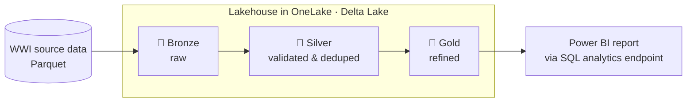
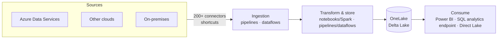

# Lakehouse tutorial

[Official docs](https://learn.microsoft.com/en-us/fabric/data-engineering/tutorial-lakehouse-introduction)

A **lakehouse** combines the low-cost, flexible storage of a data lake with the schema and querying capabilities of a data warehouse. In this end-to-end scenario, a developer at the fictional **Wide World Importers** (WWI) retail company builds one from scratch — ingesting raw data, refining it through stages, and serving it to Power BI for sales analysis.

**Status:** ✅ Complete · **Started:** 2026-07-08 · **Completed:** 2026-07-08

!!! note "Git integration in this repo"
    The Lakehouse workspace is Git-connected, targeting the `git/end-to-end/lakehouse` folder in
    **this** repo (see `git/README.md`). Committing from the workspace syncs its item definitions
    (lakehouse, notebooks, pipelines, semantic model, report) there to keep a trace.

!!! info "Scope"
    This is a foundational walkthrough of how the Fabric experiences fit together (both pro-code and citizen-developer). It is *not* a reference architecture, an exhaustive feature list, or a set of best-practice recommendations.

## Why a lakehouse?

Traditionally, teams ran **two** systems side by side: a data warehouse for structured/transactional analytics and a data lake for big, semi/unstructured data. Keeping both in sync created silos, duplicated data, and raised total cost of ownership.

Fabric collapses this into one store by keeping **all data in OneLake in Delta Lake format**, so every engine (Spark, SQL, Power BI) reads the *same* copy — no silos, no duplication, lower cost.

## Key concepts

| Term | What it means |
| --- | --- |
| **OneLake** | The single, tenant-wide data lake built into Fabric — one copy of your data, governed centrally. |
| **Delta Lake** | The open table format Fabric standardizes on; adds ACID transactions, time travel, and schema enforcement over Parquet files. |
| **Lakehouse** | A Fabric item with a **Files** area (raw/unstructured) and a **Tables** area (Delta tables), backed by OneLake. |
| **Shortcut** | A pointer to data in another location so you can use it *without copying or moving* it. |
| **SQL analytics endpoint** | An auto-generated, read-only TDS/SQL endpoint over the lakehouse tables — lets Power BI and other tools query with T-SQL. |
| **Direct Lake** | A Power BI mode that reads Delta tables in OneLake directly — no import and no scheduled refresh. |

## Medallion architecture

The tutorial refines data through three quality layers. Data only moves forward once it meets each layer's bar.

| Layer | Purpose | Example state |
| --- | --- | --- |
| 🥉 **Bronze** | Land raw source data as-is | Parquet files ingested unchanged |
| 🥈 **Silver** | Validate, clean, and deduplicate | Conformed, deduplicated Delta tables |
| 🥇 **Gold** | Business-ready, highly refined | Aggregated tables modeled for reporting |



## What you build

Prerequisite: sign up for the free **[Fabric trial](https://learn.microsoft.com/en-us/fabric/fundamentals/fabric-trial)**. The steps below mirror the Learn tutorial nav (1–7), and these **step numbers are used consistently across this page** (tech table and section headings below).

| # | Step | Outcome |
| --- | --- | --- |
| 1 | **[Introduction](https://learn.microsoft.com/en-us/fabric/data-engineering/tutorial-lakehouse-introduction)** | Overview & architecture (this page) |
| 2 | **[Get started](https://learn.microsoft.com/en-us/fabric/data-engineering/tutorial-lakehouse-get-started)** | Create the Fabric workspace |
| 3 | **[Build a lakehouse](https://learn.microsoft.com/en-us/fabric/data-engineering/tutorial-build-lakehouse)** | Lakehouse (Files + Tables); first CSV ingest via Dataflow Gen2; default semantic model |
| 4 | **[Ingest data](https://learn.microsoft.com/en-us/fabric/data-engineering/tutorial-lakehouse-data-ingestion)** | Raw WWI Parquet bulk-loaded via a Data Factory pipeline (Bronze) |
| 5 | **[Prepare data](https://learn.microsoft.com/en-us/fabric/data-engineering/tutorial-lakehouse-data-preparation)** | Cleaned/refined Delta tables via notebook + Spark (Silver → Gold) |
| 6 | **[Create a semantic model and build a report](https://learn.microsoft.com/en-us/fabric/data-engineering/tutorial-lakehouse-build-report)** | Power BI report over the SQL analytics endpoint (Direct Lake) |
| 7 | **[Clean up resources](https://learn.microsoft.com/en-us/fabric/data-engineering/tutorial-lakehouse-clean-up)** | Workspace and items deleted |

*Optional:* orchestrate ingest + transform with a **[pipeline](https://learn.microsoft.com/en-us/fabric/data-factory/lakehouse-maintenance-activity)** (scheduling, plus Lakehouse Maintenance and Refresh SQL Endpoint activities).

## Architecture

The end-to-end flow spans four stages, from source systems to Power BI.


| Stage | What happens |
| --- | --- |
| **Data sources** | Connect to Azure Data Services, other clouds, and on-premises systems. |
| **Ingestion** | 200+ native connectors and drag-and-drop dataflows bring data in; OneLake **shortcuts** reference existing data without copying it. |
| **Transform & store** | Standardized on Delta Lake in OneLake so all engines share one dataset. Choose low-code (pipelines/dataflows) or code-first (notebooks/Spark). |
| **Consume** | Power BI reports via the built-in **SQL analytics endpoint** (T-SQL) or **Direct Lake**; non-Microsoft tools connect over the same TDS endpoint. |



## Sample dataset

The tutorial uses the **Wide World Importers (WWI)** sample database — a wholesale novelty-goods importer/distributor based in the San Francisco Bay area that sells to retailers and other wholesalers across the US.

Instead of pulling from live transactional systems, the tutorial uses WWI's ready-made dimensional model as the source. It focuses on the **Sale** fact table and its related dimensions.


## Data and transformation flow

Source data is stored as **Parquet**, one folder per table, and flows: source → lakehouse **Files** → Delta **Tables**, refined across Bronze, Silver, and Gold.


The **Sale** table demonstrates both a full load and an incremental load:

- **Initial load** — 11 months of historical data (one subfolder per month) ingested into the lakehouse table.
- **Incremental load** — when 3 months of new data arrive, updated **October** and **November** rows are *merged* into the existing table and new **December** data is *appended*.


## Technologies & services by step

Reference of the Fabric technology used at each stage — handy when working out how to integrate or reuse a given service later.

| Step | Fabric item / service | Technology | Key details |
| --- | --- | --- | --- |
| 2 · Get started | **Workspace** | — | Container for all items; trial capacity. |
| 3 · Build a lakehouse | **Lakehouse** (`wwilakehouse`) | OneLake · Delta Lake | Auto-provisions **Files** + **Tables** areas, a **SQL analytics endpoint**, and a default **semantic model**. |
| 3 · Build a lakehouse — first ingest (CSV) | **Dataflow Gen2 (CI/CD)** | Power Query | Low-code ingest of `dimension_customer.csv`. Destination auto-set to the lakehouse. Upload needs OneDrive → or use **Link to file** + Anonymous auth. |
| 4 · Ingest data | **Data Factory pipeline** | Copy data activity | Bulk copy from **Azure Blob Storage** into `Files/wwi-raw-data`. Schedulable. |
| 5 · Prepare data | **Notebook** | Spark runtime · PySpark / Spark SQL | Reads raw Parquet, writes **Delta tables** to `Tables/dbo/`. Uses default **Live Pool** (no cluster setup). |
| 6 · Semantic model & report | **Semantic model** + **Power BI report** | Direct Lake · SQL analytics endpoint | Direct Lake reads Delta from OneLake (no import/refresh). Define fact→dimension relationships, then build report. |
| 7 · Clean up resources | **Workspace** | — | Delete workspace and all items. |

### Step 4 — Data Factory pipeline (bulk ingestion)

- **Pattern:** pipeline `IngestDataFromSourceToLakehouse` → **Copy data** activity → source **Azure blobs**, destination **lakehouse Files**.
- **Public sample source** (no credentials needed):

    | Property | Value |
    | --- | --- |
    | Account URL | `https://fabrictutorialdata.blob.core.windows.net/sampledata/` |
    | Container / path | `sampledata` / `WideWorldImportersDW/parquet` |
    | Authentication | **Anonymous** |
    | File format | Binary · Recursive |
    | Destination | `Files/wwi-raw-data` in `wwilakehouse` |

- Pipelines can be **scheduled** to refresh on an interval; for incremental loads see *Incrementally load data from a data warehouse to a lakehouse*.

### Step 5 — Notebook + Spark (transform to Delta)

- **Compute:** no pool/cluster config needed — every workspace has a default **Live Pool** that starts the Spark session on first cell run.
- **Language options:** import either `Prepare and transform data - PySpark.ipynb` or `... Spark SQL.ipynb` from the [Fabric samples repo](https://github.com/microsoft/fabric-samples/tree/main/docs-samples/data-engineering/Lakehouse%20Tutorial%20Source%20Code).
- **Write optimizations** (set in cell 1):

    ```python
    spark.conf.set("spark.sql.parquet.vorder.enabled", "true")            # V-Order: faster reads, better compression
    spark.conf.set("spark.microsoft.delta.optimizeWrite.enabled", "true") # fewer, larger files
    spark.conf.set("spark.microsoft.delta.optimizeWrite.binSize", "1073741824")
    ```

    ??? note "V-Order — deeper notes ([Learn](https://learn.microsoft.com/en-us/fabric/data-engineering/delta-optimization-and-v-order))"
        **What it is** — a *write-time* optimization of the Parquet layout (row-group distribution, encoding, compression) that speeds up downstream reads across all Fabric engines. Files stay open-source Parquet-compliant, and it composes with Delta features (Z-Order, compaction, vacuum, time travel).

        **Tradeoff** — writes are ~15% slower on average; reads improve significantly. Best for **read-heavy** patterns (dashboards, interactive analytics, repeated scans).

        **Default changed** — V-Order is now **disabled by default in new workspaces** (`spark.sql.parquet.vorder.default=false`) to favor write-heavy ingestion/transform. So the tutorial explicitly turns it on.

        **Runtime 1.3+** — the older `spark.sql.parquet.vorder.enable` key is **removed**; use `spark.sql.parquet.vorder.default`. V-Order can also be applied later via `OPTIMIZE`. Remove the old key if migrating.

        **Three levels of control** (precedence: write option → session → table property):

        | Level | How | Use when |
        | --- | --- | --- |
        | Session | `SET spark.sql.parquet.vorder.default=TRUE` (applies to *all* writes in the session) | Whole notebook is read-optimized |
        | Table property | `TBLPROPERTIES("delta.parquet.vorder.enabled"="true")` (via `CREATE`/`ALTER TABLE`) | Cross-session default for one table |
        | Write operation | `.option("parquet.vorder.enabled","true")` on the DataFrame writer | Per-write control |

        Changing a table property only affects **future** writes — existing files keep their layout until rewritten (via `OPTIMIZE`/compaction). Tip: `readHeavyforSpark` / `ReadHeavy` **resource profiles** enable V-Order automatically.

    ??? note "Optimize Write & file-size tuning — deeper notes ([Learn](https://learn.microsoft.com/en-us/fabric/data-engineering/tune-file-size))"
        Right-sized files matter: too many **small files** add task/metadata overhead; too few **large files** hurt parallelism and skew I/O. Delta uses file metadata for partition pruning and data skipping.

        **Optimize Write** — *pre-write* compaction (bin-packing): shuffles in-memory data into optimally sized bins so Spark writes **fewer, larger files**, avoiding post-write cleanup. It's what the tutorial's cell 1 enables. Use it *selectively* — the shuffle adds time. Best for:

        - Partitioned tables
        - Tables with frequent small inserts
        - `MERGE` / `UPDATE` / `DELETE` that touch many files

        Related layout operations:

        | Feature | What it does | When |
        | --- | --- | --- |
        | **Optimize Write** | Pre-write bin-packing (before commit) | Controlled ingestion / partitioned writes |
        | **`OPTIMIZE`** | Post-hoc rewrite of small files into larger ones (can Z-Order) | Scheduled maintenance in quiet windows |
        | **Auto Compaction** | Auto-runs `OPTIMIZE` after a write when a partition is too fragmented | Streaming / micro-batch ingestion |

        **Target file size:**

        - `bin size` — the tutorial sets `binSize=1073741824` (1 GB) for Optimize Write; tune via `spark.databricks.delta.optimizeWrite.binSize`.
        - `delta.targetFileSize` table property unifies size across optimize/compaction/optimize-write; takes precedence over session config.
        - **Adaptive target file size** (recommended, not on by default) — Fabric picks the size from table heuristics: **128 MB** for tables < 10 GB, scaling linearly up to **1 GB** beyond ~10 TB. Enable with `spark.microsoft.delta.targetFileSize.adaptive.enabled=true`. Smaller files on small tables → up to 8× more file skipping.

- **Star schema produced** under `Tables/dbo/`:
    - Fact: `fact_sale` (partitioned by **Year**, **Quarter**).
    - Dimensions: `dimension_city`, `dimension_customer`, `dimension_date`, `dimension_employee`, `dimension_stock_item`.
    - Aggregates: `aggregate_sale_by_date_city`, `aggregate_sale_by_date_employee`.
- Delta files are **auto-registered** in the metastore — no manual `CREATE TABLE`. Requires **lakehouse schemas** enabled (use **Path 1** in the notebook).

!!! warning "Cell 3 error — `DELTA_FAILED_TO_MERGE_FIELDS` on `CustomerKey`"
    **Cause:** the `dimension_customer` Delta table already exists from the **Step 3** (Build a lakehouse) Dataflow Gen2 CSV ingest. Its CSV-inferred `CustomerKey` type differs from the Parquet source, so Cell 3's `mode("overwrite")` can't merge the two schemas.

    **Fix (verified):** add `.option("overwriteSchema", "true")` to the write in `load_full_data_from_source` so the overwrite also replaces the schema. Full corrected cell:

    ```python
    def load_full_data_from_source(table_name):
        df = spark.read.format("parquet").load('Files/wwi-raw-data/full/' + table_name)
        df = df.drop("Photo")
        df.write.mode("overwrite").option("overwriteSchema", "true").format("delta").save("Tables/dbo/" + table_name)

    full_tables = [
        "dimension_city",
        "dimension_customer",
        "dimension_date",
        "dimension_employee",
        "dimension_stock_item",
    ]

    for table in full_tables:
        load_full_data_from_source(table)
    ```

    Then **re-run the cell** — it completes (20/20 Spark jobs succeed) and all five dimension tables land in `Tables/dbo/`.

    **Alternative:** drop the conflicting Step 3 table first, then run the original cell unchanged:

    ```python
    spark.sql("DROP TABLE IF EXISTS dbo.dimension_customer")
    ```

### Step 6 — Semantic model & report (Direct Lake)

- Create the semantic model from the **SQL analytics endpoint** → it uses **Direct Lake** mode (reads Delta directly from OneLake; no import, no scheduled refresh).
- Define relationships in the web modeling experience: drag each `fact_sale` key to its dimension. Settings: **Many-to-one (\*:1)**, single cross-filter, **Assume referential integrity** checked. `fact_sale` is always the *From* table.
- Build the report — two options:
    - **New report** — opens a **blank** canvas; you add every visual by hand.
    - **Auto-create report** — Power BI generates a starter "Quick summary" report (measures + charts) that you can then refine. Faster for a first pass.

!!! tip "Prefer Auto-create report for a quick start"
    The Learn *Build a report* step uses **New report**, which lands on an empty canvas. To get something useful immediately, pick the model's **… → Auto-create report** instead — it auto-builds visuals from the relationships, and you can edit or save it from there.

??? note "Assume referential integrity — deeper notes ([Learn](https://learn.microsoft.com/en-us/power-bi/connect-data/desktop-assume-referential-integrity))"
    **What it does** — lets the engine emit `INNER JOIN` instead of `OUTER JOIN` when querying the source, giving more efficient queries. Available only for **DirectQuery** and **Direct Lake** semantic models (so it applies here — the model is Direct Lake).

    **Requirements** (must hold or results silently go wrong):

    - The **From** column (the *many* side — here `fact_sale`'s key) is **never null/blank**.
    - Every value in the **From** column has a matching value in the **To** column (the dimension key).

    That's why `fact_sale` must be the *From* table and the `dimension_*` the *To* table — the facts reference existing dimension rows, not vice versa.

    **If set incorrectly** — no error is raised, but visuals become inconsistent: rows with a null or unmatched key are dropped by the inner join, so totals under-count (e.g. a grand total of 40 shows 30 when sliced by the broken dimension).

    **Fabric specifics** — for a Fabric semantic model this can **only** be set in the service (web modeling), not Power BI Desktop. Validation runs at edit time against current data and isn't guaranteed for very large tables or after later data changes.

## Notes

!!! warning "UI drift — Dataflow Gen2 (CI/CD)"
    In step 3 (**Build a lakehouse → Ingest sample data**), the Learn doc says *Get data → **New Dataflow Gen2***. The current Fabric UI now offers **New Dataflow Gen2 (CI/CD)** instead, with slightly different options.

    - **Dataflow Gen2 (CI/CD)** is the newer, source-control-enabled variant — its definition is tracked by **Git integration** and **deployment pipelines** (the classic Gen2 was not). This is the one to pick given this workspace is Git-connected.
    - The ingest flow is otherwise the same: *Import from a Text/CSV file → Upload file → `dimension_customer.csv` → set query name `dimension_customer` (lowercase, no spaces) → **Save and Run***.
    - Destination is auto-set to the lakehouse because the dataflow was created *from* the lakehouse. Creating it from the workspace instead requires manually adding a data destination.

!!! tip "No OneDrive for Business? Link the CSV by URL instead"
    The doc's **Upload file** path needs OneDrive (files are staged there before ingestion). Without a OneDrive for Business license, skip the upload and point the dataflow at the file's raw URL:

    - In the Text/CSV connector choose **Link to file** and paste:
      `https://raw.githubusercontent.com/microsoft/fabric-samples/refs/heads/main/docs-samples/data-engineering/dimension_customer.csv`
    - Set **Authentication kind** to **Anonymous**.

- (2026-07-08) Working through step 3 — created `wwilakehouse`, ingesting `dimension_customer.csv` via Dataflow Gen2 (CI/CD).
- (2026-07-08) Completed all 7 steps end to end — pipeline ingest, Spark transform to Delta star schema, Direct Lake semantic model, and report.

## Key takeaways

- **One copy, many engines** — standardizing on Delta Lake in OneLake removes the warehouse/lake silo; Spark, the SQL analytics endpoint, and Power BI all read the same tables.
- **Medallion in practice** — raw Parquet (Bronze) → cleaned/deduped Delta (Silver) → aggregated star schema (Gold) yields reliable, analysis-ready data.
- **Two ingestion styles** — low-code **Dataflow Gen2 (CI/CD)** for a quick CSV; **Data Factory Copy activity** for bulk, schedulable loads from Azure Blob.
- **Spark without setup** — the default **Live Pool** starts the session automatically; **V-Order** + **Optimize Write** tune file layout for read performance.
- **Direct Lake reporting** — the semantic model reads Delta directly (no import/refresh); relationships + **Assume referential integrity** enable efficient inner joins.

*Curated from [Microsoft Learn](https://learn.microsoft.com/en-us/fabric/data-engineering/tutorial-lakehouse-introduction) · Updated 2026-02-21*
