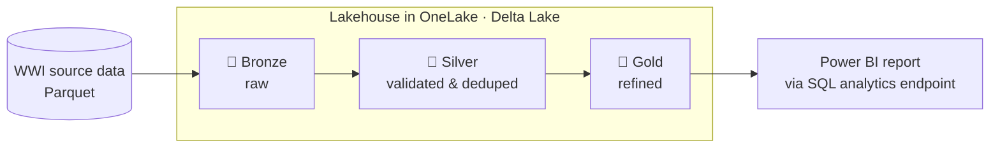
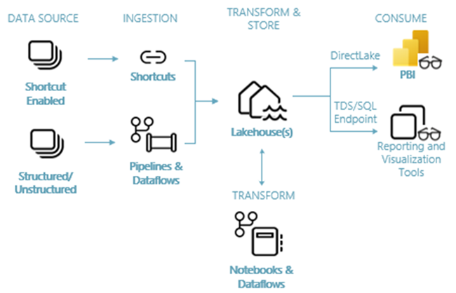
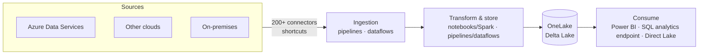
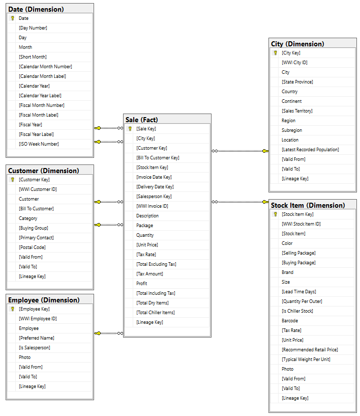
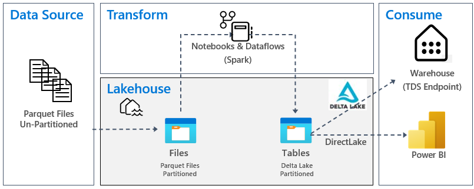
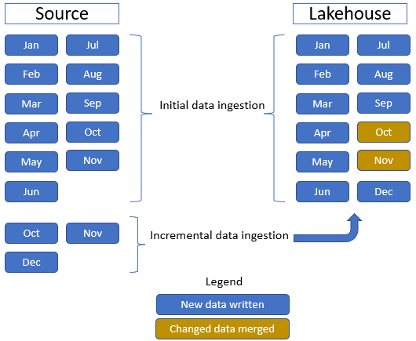

# Lakehouse tutorial

[Official docs](https://learn.microsoft.com/en-us/fabric/data-engineering/tutorial-lakehouse-introduction)

A **lakehouse** combines the low-cost, flexible storage of a data lake with the schema and querying capabilities of a data warehouse. In this end-to-end scenario, a developer at the fictional **Wide World Importers** (WWI) retail company builds one from scratch — ingesting raw data, refining it through stages, and serving it to Power BI for sales analysis.

**Status:** 🟡 In progress · **Started:** 2026-07-08

!!! note "Git integration in this repo"
    The Lakehouse workspace is Git-connected, targeting the `git/end-to-end/lakehouse` folder in
    **this** repo (see `git/README.md`). Committing from the workspace syncs its item definitions
    (lakehouse, notebooks, pipelines, semantic model, report) there to keep a trace.

!!! info "Scope"
    This is a foundational walkthrough of how the Fabric experiences fit together (both pro-code and citizen-developer). It is *not* a reference architecture, an exhaustive feature list, or a set of best-practice recommendations.

## Why a lakehouse?

Traditionally, teams ran **two** systems side by side: a data warehouse for structured/transactional analytics and a data lake for big, semi/unstructured data. Keeping both in sync created silos, duplicated data, and raised total cost of ownership.

Fabric collapses this into one store by keeping **all data in OneLake in Delta Lake format**, so every engine (Spark, SQL, Power BI) reads the *same* copy — no silos, no duplication, lower cost.

## Key concepts

| Term | What it means |
| --- | --- |
| **OneLake** | The single, tenant-wide data lake built into Fabric — one copy of your data, governed centrally. |
| **Delta Lake** | The open table format Fabric standardizes on; adds ACID transactions, time travel, and schema enforcement over Parquet files. |
| **Lakehouse** | A Fabric item with a **Files** area (raw/unstructured) and a **Tables** area (Delta tables), backed by OneLake. |
| **Shortcut** | A pointer to data in another location so you can use it *without copying or moving* it. |
| **SQL analytics endpoint** | An auto-generated, read-only TDS/SQL endpoint over the lakehouse tables — lets Power BI and other tools query with T-SQL. |
| **Direct Lake** | A Power BI mode that reads Delta tables in OneLake directly — no import and no scheduled refresh. |

## Medallion architecture

The tutorial refines data through three quality layers. Data only moves forward once it meets each layer's bar.

| Layer | Purpose | Example state |
| --- | --- | --- |
| 🥉 **Bronze** | Land raw source data as-is | Parquet files ingested unchanged |
| 🥈 **Silver** | Validate, clean, and deduplicate | Conformed, deduplicated Delta tables |
| 🥇 **Gold** | Business-ready, highly refined | Aggregated tables modeled for reporting |

## What you build

The tutorial is a sequence of chapters. Each produces a concrete artifact:

| # | Step | Outcome |
| --- | --- | --- |
| 1 | Sign up for the free **Fabric trial** | A trial capacity to run the workload |
| 2 | Create a **workspace** | A container for all tutorial items |
| 3 | Create a **lakehouse** | Storage with Files + Tables areas in OneLake |
| 4 | **Ingest** data | Raw WWI Parquet loaded into the lakehouse (Bronze) |
| 5 | **Transform** data | Cleaned/refined Delta tables (Silver → Gold) |
| 6 | Build a **semantic model + report** | Power BI report over the SQL analytics endpoint |
| 7 | *(Optional)* Orchestrate with a **pipeline** | Scheduled ingest + transform, plus Lakehouse Maintenance and Refresh SQL Endpoint activities |
| 8 | **Clean up** | Workspace and items deleted |

## Architecture

The end-to-end flow spans four stages, from source systems to Power BI.

| Stage | What happens |
| --- | --- |
| **Data sources** | Connect to Azure Data Services, other clouds, and on-premises systems. |
| **Ingestion** | 200+ native connectors and drag-and-drop dataflows bring data in; OneLake **shortcuts** reference existing data without copying it. |
| **Transform & store** | Standardized on Delta Lake in OneLake so all engines share one dataset. Choose low-code (pipelines/dataflows) or code-first (notebooks/Spark). |
| **Consume** | Power BI reports via the built-in **SQL analytics endpoint** (T-SQL) or **Direct Lake**; non-Microsoft tools connect over the same TDS endpoint. |

## Sample dataset

The tutorial uses the **Wide World Importers (WWI)** sample database — a wholesale novelty-goods importer/distributor based in the San Francisco Bay area that sells to retailers and other wholesalers across the US.

Instead of pulling from live transactional systems, the tutorial uses WWI's ready-made dimensional model as the source. It focuses on the **Sale** fact table and its related dimensions.

## Data and transformation flow

Source data is stored as **Parquet**, one folder per table, and flows: source → lakehouse **Files** → Delta **Tables**, refined across Bronze, Silver, and Gold.

The **Sale** table demonstrates both a full load and an incremental load:

- **Initial load** — 11 months of historical data (one subfolder per month) ingested into the lakehouse table.
- **Incremental load** — when 3 months of new data arrive, updated **October** and **November** rows are *merged* into the existing table and new **December** data is *appended*.

## Notes

-

## Key takeaways

-

## Follow-ups

-

*Curated from [Microsoft Learn](https://learn.microsoft.com/en-us/fabric/data-engineering/tutorial-lakehouse-introduction) · Updated 2026-02-21*
