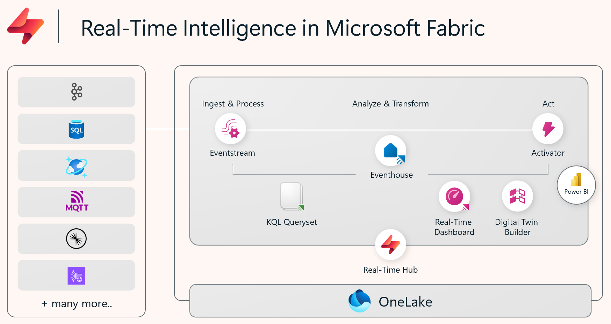
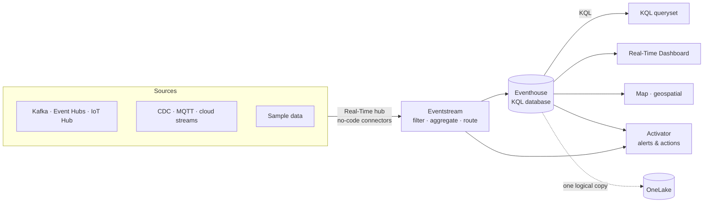
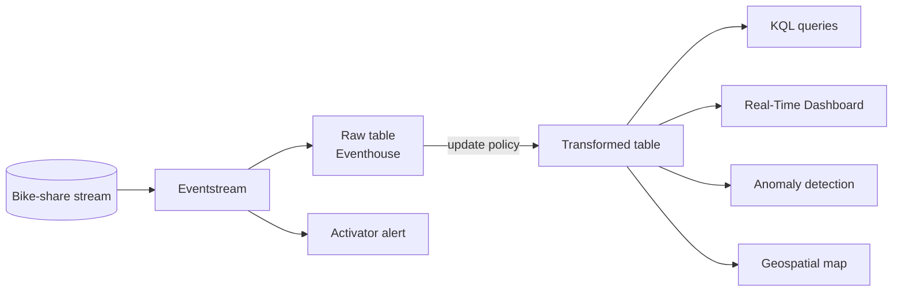

# Real-Time Intelligence tutorial

[Official docs](https://learn.microsoft.com/en-us/fabric/real-time-intelligence/tutorial-introduction)

**Real-Time Intelligence (RTI)** is Fabric's end-to-end solution for data *in motion* — event-driven scenarios, streaming ingestion, and log analytics. In this tutorial you stream a live **London bike-share** feed, land it in an Eventhouse, transform and query it with **KQL**, then act on it with alerts, a Real-Time Dashboard, anomaly detection, and a geospatial map.

**Status:** ✅ Complete · **Started:** 2026-07-08 · **Completed:** 2026-07-09

!!! note "Git integration in this repo"
    The Real-Time Intelligence workspace is Git-connected, targeting the `git/end-to-end/real-time-intelligence` folder in
    **this** repo (see `git/README.md`). Committing from the workspace syncs its item definitions
    (eventhouse, KQL database, eventstream, KQL queryset, Real-Time Dashboard, Activator) there to keep a trace.

!!! info "Scope"
    This is a foundational walkthrough of how the RTI experiences fit together (streaming ingest → store → query → visualize → act). It is *not* a reference architecture, an exhaustive feature list, or a set of best-practice recommendations.

!!! warning "Tenant settings the admin may need to enable first"
    The intro tutorial page still says to enable a **maps preview** setting, but that's out of date — **Maps is now GA**. Settings to check in **Admin portal → Tenant settings**:

    - **Users can use Azure Maps services** — required for the Map step (step 8).
    - **Data sent to Azure Maps can be processed outside your capacity's geographic region…** — only enable if the Fabric capacity is **outside EU/US**.
    - **Detect anomalies in Real-Time Intelligence (Preview)** — required for anomaly detection (step 7).

## Why Real-Time Intelligence?

Traditional analytics runs on a **schedule** over data at rest. Many scenarios — IoT telemetry, logs, fraud, operations monitoring — need to **react to events as they happen**. RTI gives you a no-code-to-pro-code pipeline where streaming data converges in the **Real-Time hub**, is stored in a time-optimized **Eventhouse**, and drives instant dashboards, alerts, and actions.

Even though it's called "real-time", the data doesn't have to be high-volume or high-velocity — the point is reacting to events rather than polling on a timer.

## Key concepts

| Term | What it means |
| --- | --- |
| **Real-Time hub** | Tenant-wide catalog of data *in motion* — discover, add, and share streams and Fabric/Azure events. |
| **Eventstream** | No-code pipeline that collects, transforms, and routes streaming events to destinations (filter, aggregate, dedupe, route). |
| **Eventhouse** | The analytics store for streaming data; time-partitioned and indexed. Creates a child **KQL database** automatically. |
| **KQL database** | The queryable database inside an Eventhouse; tables are queried with **Kusto Query Language**. |
| **KQL / KQL queryset** | **Kusto Query Language** — expressive, read-optimized query language; the queryset is the authoring surface (also supports T-SQL). |
| **Update policy** | A trigger that transforms/routes rows into another table as they land (ETL inside the KQL database). |
| **Real-Time Dashboard** | Native low-latency dashboard built on KQL queries, with tiles, parameters, and auto-refresh. |
| **Activator** | The "act" component — sets alerts and triggers actions (email, Teams, pipelines, Power Automate) on patterns/thresholds. |

## Architecture

RTI spans four stages: connect streaming sources, ingest/process with Eventstream, store/analyze in an Eventhouse, then visualize and act. All data lands in **OneLake**.



| Stage | What happens |
| --- | --- |
| **Sources** | Connect Kafka, Azure Event Hubs / IoT Hub, CDC feeds, MQTT, cloud streams, and sample data via no-code connectors in the **Real-Time hub**. |
| **Ingest & process** | **Eventstream** collects, filters, aggregates, dedupes, and routes events — no code required. |
| **Analyze & transform** | **Eventhouse** (KQL database) stores time-based events; **update policies** shape data on arrival; query with **KQL**. |
| **Visualize & act** | **Real-Time Dashboards**, **maps**, and Power BI surface insights; **Activator** raises alerts and triggers actions. |



## What you build

Prerequisite: a **[workspace](https://learn.microsoft.com/en-us/fabric/fundamentals/create-workspaces)** on a Fabric-enabled **capacity**, plus the **maps** and **anomaly detector** preview settings enabled by the tenant admin. The steps below mirror the Learn tutorial nav (1–9), and these **step numbers are used consistently across this page** (tech table and section headings below).

| # | Step | Outcome |
| --- | --- | --- |
| — | **[Introduction](https://learn.microsoft.com/en-us/fabric/real-time-intelligence/tutorial-introduction)** | Overview, scenario & architecture (this page) |
| 1 | **[Set up eventhouse](https://learn.microsoft.com/en-us/fabric/real-time-intelligence/tutorial-1-resources)** | Create an Eventhouse (`Tutorial`) + child KQL database |
| 2 | **[Get data in the Real-Time hub](https://learn.microsoft.com/en-us/fabric/real-time-intelligence/tutorial-2-get-real-time-events)** | Stream bike-share events via an Eventstream into the Eventhouse |
| 3 | **[Set an alert on an eventstream](https://learn.microsoft.com/en-us/fabric/real-time-intelligence/tutorial-3-set-alert)** | Activator alert directly on the streaming events |
| 4 | **[Transform data in your KQL database](https://learn.microsoft.com/en-us/fabric/real-time-intelligence/tutorial-4-transform-kql-database)** | **Update policy** transforms rows on ingest into a target table |
| 5 | **[Query streaming data using KQL](https://learn.microsoft.com/en-us/fabric/real-time-intelligence/tutorial-5-query-data)** | KQL queries (with Copilot assist) over the streamed data |
| 6 | **[Create a Real-Time dashboard](https://learn.microsoft.com/en-us/fabric/real-time-intelligence/tutorial-6-create-dashboard)** | Dashboard tiles from KQL queries, with exploration |
| 7 | **[Detect anomalies on an eventhouse table](https://learn.microsoft.com/en-us/fabric/real-time-intelligence/tutorial-7-create-anomaly-detection)** | Anomaly detection over a time-series table (preview) |
| 8 | **[Create a map using geospatial data](https://learn.microsoft.com/en-us/fabric/real-time-intelligence/tutorial-8-create-map)** | Geospatial map of bike locations (preview) |
| 9 | **[Clean up resources](https://learn.microsoft.com/en-us/fabric/real-time-intelligence/tutorial-9-clean-up-resources)** | Workspace and items deleted |

## Sample dataset

The tutorial streams a **London bike-share** dataset: each event describes a bike station reading — bike ID, station location (latitude/longitude), neighbourhood, timestamp, number of bikes, empty docks, and so on. Because every record carries a **timestamp** and **coordinates**, it's a natural fit to demonstrate the full RTI stack: time-series querying, anomaly detection, and geospatial mapping.

## Data and transformation flow

Events flow: source → **Eventstream** (optional in-flight transforms) → **Eventhouse** table. Inside the KQL database, an **update policy** reshapes rows as they land into a refined table, which then feeds queries, the dashboard, anomaly detection, and the map.



## Technologies & services by step

Reference of the Fabric technology used at each stage — handy when working out how to integrate or reuse a given service later.

| Step | Fabric item / service | Technology | Key details |
| --- | --- | --- | --- |
| 1 · Set up eventhouse | **Eventhouse** (`Tutorial`) | KQL engine · OneLake | Creating the Eventhouse auto-creates a child **KQL database** of the same name. All tutorial items go in **one workspace**. |
| 2 · Get data | **Eventstream** + **Real-Time hub** | No-code streaming | Bring the bike-share stream in via the Real-Time hub; Eventstream routes it to the Eventhouse (KQL database) destination. |
| 3 · Set an alert (eventstream) | **Activator** | Rules on streams | Alert on the streaming events *before* storage — threshold/pattern → action (email/Teams). |
| 4 · Transform in KQL DB | **Update policy** | KQL (`.alter table ... policy update`) | Trigger that transforms/routes rows into a target table as they're ingested (in-database ETL). |
| 5 · Query data | **KQL queryset** + **Copilot** | Kusto Query Language (T-SQL also) | Author queries over streamed data; Copilot can draft KQL from natural language. |
| 6 · Real-Time dashboard | **Real-Time Dashboard** | KQL-backed tiles | Tiles from KQL queries; parameters, auto-refresh, and Copilot-assisted exploration. |
| 7 · Anomaly detection | **Eventhouse** (anomaly detection, preview) | Time-series ML in KQL | Runs in place over the time-series table — no data movement. Requires the anomaly-detector preview setting. |
| 8 · Create a map | **Map** (GA) | Geospatial visualization | Plots bike locations from lat/long; supports bubbles/heatmaps and KQL-driven refresh. Only needs the **Azure Maps services** cross-region tenant setting if your capacity is outside EU/US. |
| 9 · Clean up | **Workspace** | — | Delete the workspace and all items to release capacity. |

## Notes

!!! warning "Step 3 — \"Rule creation failed\" when saving the alert"
    On clicking **Create** in the *Set alert* pane, a *"Rule creation failed — check your network connection or try refreshing the page"* toast appeared and the `TutorialActivator` item wasn't created.

    **Fix (verified):** it was transient — **refreshing the page and clicking Create again** worked. The pane keeps the rule settings. If a refresh doesn't fix it, check the Reflex/Activator Entra app isn't blocked, the capacity isn't paused/throttled, and delete any half-created Activator item before retrying.

!!! warning "Pausing the capacity stops the eventstream — reactivate on resume"
    Pausing the Fabric capacity (e.g. overnight to save cost) **stops all running workloads**, including the eventstream. On **resume**, the eventstream stays stopped — its nodes show **Inactive** — so no new data flows into `RawData`.

    **Symptom:** in step 4, `TransformedData` stays empty (update policies are **forward-only** — they only transform data ingested *after* the policy exists, so no new ingest = no transformed rows). The eventstream editor's **Data preview** still shows rows, but that only *samples* the source — it is **not** live ingestion.

    **Fix (verified):** open the eventstream and click **Activate all** in the toolbar (Publish first if there are draft changes); wait for nodes to turn **Active**. Confirm ingestion resumed with `RawData | count` run twice a few seconds apart — the count should increase — then `TransformedData | take 10` fills.

    **Notes:** the Eventhouse tables and earlier rows persist across pause/resume (you just get a gap for the paused window). The Activator alert, dashboard, and anomaly detection all need the capacity **running**.

!!! tip "Step 5 — timechart unreadable after a pause gap? Restrict the time window"
    The step 5 query renders a timechart of `No_Bikes`:

    ```kusto
    TransformedData
    | where BikepointID > 100 and Neighbourhood == "Chelsea"
    | project Timestamp, No_Bikes
    | render timechart
    ```

    After a pause/resume, the X axis spans the whole idle gap, so all the recent points get crushed into a single spike on the right and you can't read anything. Add a **time filter** so the chart only covers live data:

    ```kusto
    TransformedData
    | where Timestamp > ago(30m)
    | where BikepointID > 100 and Neighbourhood == "Chelsea"
    | project Timestamp, No_Bikes
    | render timechart
    ```

    Tune `ago(30m)` to just cover the period since you reactivated the stream. In a **Real-Time Dashboard**, prefer the tile's built-in **time range** picker instead of hard-coding `ago()`.

!!! warning "Step 6 — UI drift: \"Add visual\" now asks for the visual type up front"
    The lab says to run the query, then *"select the expand button in the **Visualization** pane to see all options."* The current editor instead shows the **visual-type picker immediately** when you click **Add visual** (Time Series, Bar, Column, Pie, Table, Area, Line, Scatter, Anomaly, **Map**…).

    - For the "Add a new tile by using a query" step, the tile is the **Bike locations Map** — **scroll down past *Anomaly chart* and pick *Map***, then set *Define location by* = Latitude and longitude, *Latitude* = `Latitude`, *Longitude* = `Longitude`, *Label* = `BikepointID`.
    - Tiles **default to a Table** if you don't choose a type, so you must actively select **Map**.
    - Doc inconsistency: the later *Set an alert* step calls it "the new **bar chart** tile," but the tile is the **Map**. Set the alert on the **Bike locations Map** tile — the alert config is the same regardless of visual type.

## Key takeaways

- **Medallion architecture lives *inside* the Eventhouse.** The tutorial layers the data by tier, even though the lab never spells it out: 🥉 **Bronze** = `RawData` (raw ingested table) → 🥈 **Silver** = `TransformedData` (cleaned/enriched table populated by an **update policy**) → 🥇 **Gold** = `AggregatedData` (a **materialized view** with business-ready aggregates). A materialized view is the natural Gold shape for aggregations because it stays current automatically and is cheap to query — ideal for feeding dashboards/reports (Part 6 reuses it). The `with (folder="Bronze|Silver|Gold")` is just an **organizational label**, not an enforced policy. See [Implement a medallion architecture in RTI](https://learn.microsoft.com/en-us/fabric/real-time-intelligence/architecture-medallion).
- **The KQL queryset runs T-SQL too — and `explain` converts SQL → KQL.** You can query Eventhouse tables with **T-SQL** directly (e.g. `SELECT top(10) * FROM AggregatedData ORDER BY No_Bikes DESC`), which eases the ramp from a SQL background. Prefix any T-SQL `SELECT` with **`explain`** to get the equivalent **KQL** emitted in the results pane — a fast way to *learn* KQL by translating queries you already know. The generated KQL is functionally equivalent but not necessarily optimized, so treat it as a starting point.
- **Copilot drafts KQL from natural language.** The queryset's **Copilot** turns a plain-English question (e.g. *"What is the average number of bikes at each bike point?"*) into a runnable KQL query you **Insert** then **Run**. Naming the target object in the prompt (e.g. *"use the AggregatedData materialized view"*) yields a more accurate query, and follow-up questions refine scope — useful both to move fast and to learn KQL patterns. Still review the output before trusting it.

*Curated from [Microsoft Learn](https://learn.microsoft.com/en-us/fabric/real-time-intelligence/tutorial-introduction) · Updated 2025-10-21*
