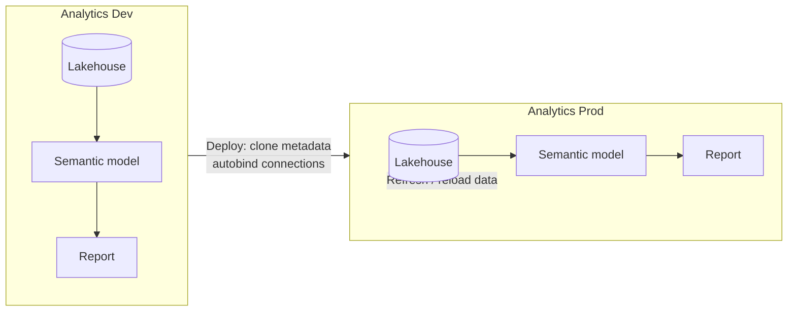

# 0 · Deployment pipelines

!!! info "Source"
    [AzurePortal/4_CICD/0_deployment-pipelines](https://github.com/Cloud2BR-MSFTLearningHub/MS-Fabric-Essentials-Workshop/tree/main/AzurePortal/4_CICD/0_deployment-pipelines)

**Status:** 🟡 In progress

!!! note "Git integration is wired up in this repo"
    The **Analytics Dev** workspace in this lab is connected to Git, targeting the
    `git/ms-fabric-essentials/deployment-pipelines` folder in **this** repo (see `git/README.md`).
    As you build the lakehouse, semantic model, and report below, committing from the workspace
    syncs those item definitions here — so the [GitHub integration](github-integration.md) piece is
    covered by doing this lab.

A **deployment pipeline** promotes Fabric content across **stages** — typically
**development**, **test**, and **production** — where each stage is its own workspace.
Deploying **clones the structure and metadata** (lakehouse schema, semantic models, reports)
to the target stage, **not the data** in the tables, so data must be refreshed there.

## Key concepts

- **Stages = workspaces** — each pipeline stage maps to a separate workspace (e.g. `Analytics Dev`, `Analytics Prod`).
- **Content cloning** — deployment copies metadata, reports, dashboards, and semantic models; table **data is not copied**.
- **Autobinding** — connections between items are preserved on deploy (e.g. a report stays bound to its semantic model).
- **Ownership** — only an artifact's **owner** can deploy it. Use a **service principal** as owner to automate deployments securely.
- **Deployment rules** — for notebooks and pipelines, set per-stage rules (e.g. the **default lakehouse**) so you avoid manual rebinding after each deploy.

!!! warning "Lakehouse data isn't deployed"
    For lakehouses, deployment carries the **structure and metadata** but **not the table data**.
    After promoting, **refresh or reload** the data in the target stage.

## Flow

## Demo — Dev → Prod

1. **Create workspaces** — make `Analytics Dev` and `Analytics Prod`, each allocated to a Fabric capacity.
2. **Create a lakehouse** — in `Analytics Dev`, add a lakehouse (e.g. `Sales_Data_Lakehouse`), then **Get data → Upload files** and **Load to Tables**.
3. **Create a semantic model** — use **New semantic model**, pick tables/views, and save it to the workspace.
4. **Auto-generate a report** — on the semantic model, choose **Auto-create report** (Copilot), then **Save**.
5. **Create a deployment pipeline** — in the portal open **Deployment Pipelines**, create one (e.g. `Dev to Prod Pipeline`), and customise the stages (here just **Development** and **Production**).
6. **Assign workspaces** — assign `Analytics Dev` as the source stage and `Analytics Prod` as the target.
7. **Deploy to production** — run the pipeline to clone the lakehouse, semantic model, and report into `Analytics Prod`, then verify.

## Refreshing data after deployment

Because table data isn't cloned, refresh it in the target stage using one of:

| Method | What it does |
| --- | --- |
| **Scheduled refresh** | Refreshes data automatically at set intervals (can run several times a day) to keep the target current. |
| **On-demand refresh** | Immediate refresh, triggered manually (workspace list / lineage view) or via a pipeline with a dataflow activity. |
| **Incremental refresh** | Refreshes only data changed since the last run, based on a `DateTime` column — more efficient for large tables. |

!!! tip "Set up incremental refresh (Dataflow Gen2)"
    Open or create a **Dataflow Gen2**, ensure the query has a `DateTime` column, right-click the
    query → **Incremental Refresh**, configure the column and time range, then **publish**.
