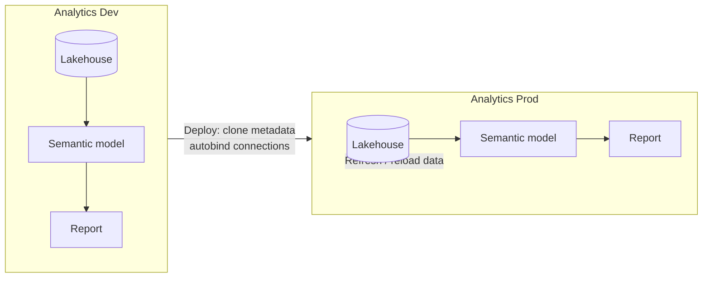

# 0 · Deployment pipelines

!!! info "Source"
    [AzurePortal/4_CICD/0_deployment-pipelines](https://github.com/Cloud2BR-MSFTLearningHub/MS-Fabric-Essentials-Workshop/tree/main/AzurePortal/4_CICD/0_deployment-pipelines)

**Status:** ✅ Complete

!!! note "Git integration is wired up in this repo"
    **Only the `Analytics Dev` workspace is connected to Git** — `Analytics Prod` is **not**.
    Dev is the source of truth; Prod only ever receives content from the deployment pipeline.
    Dev targets the `git/ms-fabric-essentials/deployment-pipelines` folder in **this** repo (see
    `git/README.md`). As you build the lakehouse, semantic model, and report below, committing from
    the Dev workspace syncs those item definitions here — so the
    [GitHub integration](github-integration.md) piece is covered by doing this lab.

A **deployment pipeline** promotes Fabric content across **stages** — typically
**development**, **test**, and **production** — where each stage is its own workspace.
Deploying **clones the structure and metadata** (lakehouse schema, semantic models, reports)
to the target stage, **not the data** in the tables, so data must be refreshed there.

## Key concepts

- **Stages = workspaces** — each pipeline stage maps to a separate workspace (e.g. `Analytics Dev`, `Analytics Prod`).
- **Content cloning** — deployment copies metadata, reports, dashboards, and semantic models; table **data is not copied**.
- **Autobinding** — connections between items are preserved on deploy (e.g. a report stays bound to its semantic model).
- **Ownership** — only an artifact's **owner** can deploy it. Use a **service principal** as owner to automate deployments securely.
- **Deployment rules** — for notebooks and pipelines, set per-stage rules (e.g. the **default lakehouse**) so you avoid manual rebinding after each deploy.

!!! warning "Lakehouse data isn't deployed"
    For lakehouses, deployment carries the **structure and metadata** but **not the table data**.
    After promoting, **refresh or reload** the data in the target stage.

## Flow

## Demo — Dev → Prod

!!! info "Where does each step happen?"
    You build **everything in `Analytics Dev`** (steps 2–4). `Analytics Prod` starts **empty** — you
    never create items in it by hand. The deployment pipeline (steps 5–7) *clones* Dev's content into
    Prod. So Dev = where you author; Prod = deploy target only.

### In `Analytics Dev` — build the content

1. **Create the two workspaces** — create `Analytics Dev` and `Analytics Prod` (portal → **Workspaces → New workspace**), each assigned to a Fabric capacity. Leave `Analytics Prod` empty for now.
2. **Create the lakehouse** *(in `Analytics Dev`)* — **New item → Lakehouse** (e.g. `Sales_Data_Lakehouse`), then **Get data → Upload files** and **Load to Tables** to land the sample data.
3. **Create the semantic model** *(in `Analytics Dev`)* — from the lakehouse, **New semantic model**, pick the tables/views, and save it to `Analytics Dev`.
4. **Auto-generate the report** *(in `Analytics Dev`)* — on the semantic model choose **Auto-create report** (Copilot), then **Save**. You now have lakehouse + model + report, all in Dev.

### In Deployment Pipelines — promote to Prod

5. **Create the pipeline** — portal → **Deployment Pipelines → New pipeline** (e.g. `Dev to Prod Pipeline`); customise stages to just **Development** and **Production**.
6. **Assign workspaces to stages** — assign **`Analytics Dev` → Development** (source) and **`Analytics Prod` → Production** (target).
7. **Deploy** — in the new pipelines UI, **select the target stage (`Production`)**, set **Deploy from → Development**, then **tick the items** you want (semantic model, report, lakehouse). The **Deploy** button only becomes active once a target and items are selected. Deploy clones those items into `Analytics Prod`; verify they appear, then **refresh the data** (see below) since only structure is copied.

!!! tip "New Deployment Pipelines UI"
    The layout changed from older tutorials. You now **click the target stage** (`Production`) to open
    its panel, pick **Deploy from** the source stage, and **select the items** in the comparison list —
    only then does the green **Deploy** button appear. Items show as *Only in source* on the first deploy.

### After a successful deploy

Once the deploy completes, the **Production** stage turns green with a **Successful deployment** badge
and a timestamp, and every item now compares as **Same as source** — Dev and Prod are in sync
(structure only; data still needs refreshing). Note the lakehouse also brings its **SQL analytics
endpoint**.

## Refreshing data after deployment

!!! important "Refresh is set in the *workspace*, not the pipeline"
    The deployment pipeline only **moves and rebinds** content — it has **no refresh setting**.
    You configure refresh on the **item itself in the `Analytics Prod` workspace**. Mental model:
    **pipeline = move & rebind · workspace = run & refresh**.

    | Task | Where you do it |
    | --- | --- |
    | Schedule the **semantic model** refresh | `Analytics Prod` workspace → the semantic model → **Settings / Refresh** |
    | Reload **lakehouse table data** | `Analytics Prod` workspace → run the **notebook / data pipeline**, or **Get data** |
    | Bind a notebook's **default lakehouse** to Prod | The **pipeline** → Production stage → **Deployment settings → Deployment rules** |

### Schedule the semantic model refresh

In the `Analytics Prod` workspace, on the semantic model → **⋯ → Settings** (or **Refresh → Schedule refresh**):

1. Re-enter **data source credentials** if prompted (a freshly deployed model often needs them).
2. Turn **Refresh** on, set **frequency**, **time zone**, and **time(s)**; optionally enable failure notifications.
3. **Apply**, then use **Refresh now** to populate immediately.

Because table data isn't cloned, refresh it in the target stage using one of:

| Method | What it does |
| --- | --- |
| **Scheduled refresh** | Refreshes data automatically at set intervals (can run several times a day) to keep the target current. |
| **On-demand refresh** | Immediate refresh, triggered manually (workspace list / lineage view) or via a pipeline with a dataflow activity. |
| **Incremental refresh** | Refreshes only data changed since the last run, based on a `DateTime` column — more efficient for large tables. |

!!! tip "Set up incremental refresh (Dataflow Gen2)"
    Open or create a **Dataflow Gen2**, ensure the query has a `DateTime` column, right-click the
    query → **Incremental Refresh**, configure the column and time range, then **publish**.
