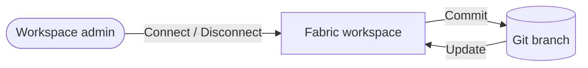

# 1 · GitHub integration

!!! info "Source"
    [AzurePortal/4_CICD/1_github-integration.md](https://github.com/Cloud2BR-MSFTLearningHub/MS-Fabric-Essentials-Workshop/blob/main/AzurePortal/4_CICD/1_github-integration.md)

**Status:** ✅ Documented

!!! note "Set up in this repo"
    Git integration for this workshop targets the `git/ms-fabric-essentials/deployment-pipelines`
    folder in **this** repo (see `git/README.md`). Because the **Analytics Dev** workspace from the
    [Deployment pipelines](deployment-pipelines.md) lab is connected to Git, running that lab
    syncs the items automatically — no separate GitHub integration lab is needed here.

## Git-integrated labs in this repo

Each Git-connected workspace maps to its own folder under `git/` (see `git/README.md`):

| Lab | Fabric Git folder path | Status |
| --- | --- | --- |
| [Medallion Architecture](../medallion-architecture.md) | `/git/ms-fabric-essentials/medallion-architecture` | ✅ Complete |
| [Deployment pipelines](deployment-pipelines.md) | `/git/ms-fabric-essentials/deployment-pipelines` | 🟡 In progress |

**Git integration** connects a Fabric workspace to a **GitHub** (or Azure DevOps) repository so
item definitions are version-controlled. You edit the workspace as normal, then **commit**
changes to a branch and **update** the workspace when the branch changes — giving you source
control, history, and ALM for Fabric items.

## Workspace ↔ Git lifecycle

## Key operations

- **Connect a workspace to a Git repo** — only a **workspace admin** can link a workspace to a repo. Once linked, anyone with the right permission can work in it.
- **Connect to an already-linked workspace** — if the workspace is already integrated, follow the shared-workspace connection flow.
- **Commit changes to Git** — edits are saved to the workspace first; when ready, **commit** them to the branch (or revert to the previous state).
- **Update workspace from Git** — when a new commit lands on the connected branch, the workspace shows a notification; use the **Source control** panel to pull, merge, or revert into live items.
- **Disconnect a workspace from Git** — only a **workspace admin** can disconnect a workspace from its repo.

!!! note "Admin-only actions"
    Connecting and disconnecting a workspace both require **workspace admin** rights. If you're
    not an admin, ask one to set up (or remove) the connection.

## Official references

- [Get started with Git integration](https://learn.microsoft.com/en-us/fabric/cicd/git-integration/git-get-started)
- [The Git integration process](https://learn.microsoft.com/en-us/fabric/cicd/git-integration/git-integration-process)
- [Considerations and limitations](https://learn.microsoft.com/en-us/fabric/cicd/git-integration/git-get-started#considerations-and-limitations)
