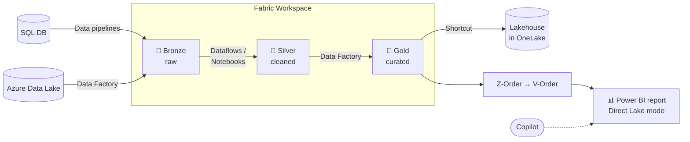
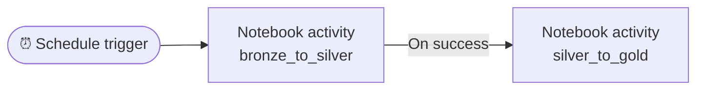

# 1 · Medallion Architecture

!!! info "Source"
    [AzurePortal/1_MedallionArch](https://github.com/Cloud2BR-MSFTLearningHub/MS-Fabric-Essentials-Workshop/tree/main/AzurePortal/1_MedallionArch)

**Status:** ✅ Complete

!!! note "Git integration in this repo"
    The Medallion workspace is Git-connected, targeting the
    `git/ms-fabric-essentials/medallion-architecture` folder in **this** repo (see `git/README.md`).
    Committing from the workspace syncs its item definitions (lakehouses, notebooks, Data Factory
    pipelines, semantic model, report) there to keep a trace.

## What this lab does

Builds an end-to-end medallion pipeline in Microsoft Fabric — raw data lands in **Bronze**, gets cleaned in **Silver**, and is curated/aggregated in **Gold**, then surfaced to Power BI for reporting. Data moves between layers with notebooks (PySpark) and is orchestrated with Data Factory pipelines.

The three refinement layers:

| Layer | Lakehouse | Purpose |
| --- | --- | --- |
| 🥉 Bronze | `raw_Bronze` | Raw, append-only landing zone for ingested data. |
| 🥈 Silver | `cleansed_Silver` | Cleaned, transformed, enriched, quality-checked data. |
| 🥇 Gold | `curated_Gold` | Curated, aggregated data optimized for BI/reporting. |

## Flow


Simplified view:



## Ingesting into Bronze (Step 2)

Step 2 shows **several ways** to land data in Bronze — you only need **one**. Azure SQL is **not** required.

| Source | How | Needs Azure SQL? |
| --- | --- | --- |
| **CSV / files** | Upload to `raw_Bronze` → **Load to Tables** | ❌ |
| **SQL — Data pipeline** | Data Factory **Copy activity** into Bronze (batch/scheduled) | ✅ (source is SQL) |
| **SQL — Mirroring** | Continuously **synced replica** of the SQL DB in Fabric (near real-time, no pipeline authoring) | ✅ (source is SQL) |

- **Pipeline vs mirroring** are *alternatives* for a SQL source — pick one. Pipeline = you control a copy step; mirroring = auto-synced copy.
- The provided sample datasets are **different**: the CSVs are `2020orders.csv` + `products.csv` (a sales scenario); the SQL script creates a separate `dbo.Employees` table (an HR scenario).

!!! tip "Recommended path for this lab"
    Use the **CSV path**. The sample notebooks ([bronze→silver](https://github.com/Cloud2BR-MSFTLearningHub/MS-Fabric-Essentials-Workshop/blob/main/AzurePortal/1_MedallionArch/src/0_notebook_bronze_to_silver.ipynb), [silver→gold](https://github.com/Cloud2BR-MSFTLearningHub/MS-Fabric-Essentials-Workshop/blob/main/AzurePortal/1_MedallionArch/src/1_notebook_silver_to_gold.ipynb)) run against the `2020orders` and `products` tables end-to-end — the SQL/`Employees` path is only an alternative ingestion illustration and isn't used in Steps 3–6. Just fix the `abfss://` lakehouse paths to match your workspace.

??? note "Optional — SQL source path (Azure SQL → Bronze)"

    Do this only if you want to practice ingesting from a relational source. It's **independent** of the CSV path and uses a different dataset (`dbo.Employees`).

    !!! warning "Cost"
        Azure SQL Database is **not free**. Pick the **Serverless** compute tier (auto-pause) or **Basic** DTU tier to keep costs minimal, and delete the resource group when finished.

    **Suggested names**

    | Item | Name | Notes |
    | --- | --- | --- |
    | Resource group | `rg-fabric-essentials` | |
    | SQL logical server | `sql-fabric-essentials-<unique>` | globally unique, lowercase |
    | SQL database | `employees_db` | source DB |
    | Ingestion pipeline (Fabric) | `sql_to_bronze` | if using a pipeline |
    | Mirrored DB (Fabric) | `employees_mirrored` | if using mirroring |

    **1 · Create the Azure SQL Database** (Azure Portal)

    1. **Create resource → SQL Database**. Create a new **resource group** `rg-fabric-essentials`.
    2. **Database name** `employees_db`. Under **Server**, create a new server named `sql-fabric-essentials-<unique>`, choose a region, and set **SQL authentication** with an admin login + password (note them).
    3. **Compute + storage** → choose **Serverless** (General Purpose) or the **Basic** tier to minimise cost.
    4. **Networking** tab → set **Connectivity** to **Public endpoint**, and enable **Allow Azure services…** plus **Add current client IP address** so you and Fabric can connect.
    5. **Review + create**.

    **2 · Create the sample table** (Query editor in the portal, or SSMS/Azure Data Studio)

    ```sql
    CREATE TABLE dbo.Employees (
        EmployeeID INT PRIMARY KEY,
        FirstName VARCHAR(50),
        LastName VARCHAR(50),
        BirthDate DATE,
        HireDate DATE,
        JobTitle VARCHAR(50),
        Salary DECIMAL(10, 4)
    );

    INSERT INTO dbo.Employees (EmployeeID, FirstName, LastName, BirthDate, HireDate, JobTitle, Salary)
    VALUES
    (1, 'John', 'Doe', '1985-11-15', '2010-03-10', 'Software Engineer', 75000.0000),
    (2, 'Jane', 'Smith', '1990-05-22', '2012-07-18', 'Project Manager', 85000.0000),
    (3, 'Emily', 'Jones', '1988-04-17', '2014-06-25', 'Data Analyst', 65000.0000),
    (4, 'Michael', 'Brown', '1982-06-21', '2008-09-15', 'HR Specialist', 55000.0000),
    (5, 'Sarah', 'Davis', '1995-09-30', '2020-11-20', 'Marketing Specialist', 60000.0000);
    ```

    **3 · Ingest into Bronze** — do **one or both** (they use different target names, so they coexist and let you compare batch vs. near-real-time):

    === "Pipeline (Copy activity)"

        1. Fabric workspace → **New → Data pipeline**, name it `sql_to_bronze`.
        2. On the pipeline canvas, choose **Copy data → Add to canvas** (or **Copy data assistant** for a guided wizard). This adds a **Copy activity**; select it, and on the **General** tab rename it from `Copy data1` to **`copy_employees`**. Configure its tabs below.
        3. **Source** tab → **Data store type: External** → **Connection → New**:
            - Connector: **Azure SQL Database**.
            - **Server**: `sql-fabric-essentials-<unique>.database.windows.net` · **Database**: `employees_db`.
            - **Authentication kind**: **Basic**, then enter the SQL admin **username/password** you set. **Create**.
            - **Connection** now set → for **Use query** choose **Table**, and pick `dbo.Employees` (or use **Query** for a custom `SELECT`). Use **Preview data** to confirm rows load.
        4. **Destination** tab → **Data store type: Workspace** → **Lakehouse** → select **`raw_Bronze`**:
            - **Root folder: Tables** · **Table name**: `employees_pipeline` (Import schema → **Auto create table**).
            - **Table action**: **Overwrite** — replaces contents each run so re-running stays idempotent (Append would duplicate the rows; Upsert needs a key column).
        5. *(Optional)* **Mapping** tab → **Import schemas** to check column mappings (e.g. `Salary` → decimal).
        6. **Save**, then **Run**. Watch the **Output** tab for status; on success, `employees_pipeline` appears under **Tables** in `raw_Bronze`. It's a one-off **batch copy** — re-run manually or attach a schedule to refresh.

    === "Mirroring (auto-synced)"

        !!! warning "Prerequisite — enable the server's managed identity"
            Mirroring authenticates via the SQL **logical server's system-assigned managed identity (SAMI)**. If the wizard errors with *"turn on the system-assigned managed identity and set it as the primary identity"*: in the Azure Portal open the **SQL server** resource `sql-fabric-essentials-<unique>` — this is a **separate resource from the database** (type *"SQL server"*, not *"SQL database"*; the **Identity** blade is *not* on the database) → **Security → Identity**, set **System assigned managed identity → Status = On**, **Save**. If a user-assigned identity is also attached, ensure the **system-assigned** one is the **primary**. Wait ~1 minute, then retry. (This is unrelated to the serverless compute tier.)

        1. Fabric workspace → **New → Mirrored Azure SQL Database**, name it `employees_mirrored`.
        2. Connect to the Azure SQL server/database and select `dbo.Employees`.
        3. Fabric creates a **new workspace item** (the mirrored database `employees_mirrored`, plus a paired SQL analytics endpoint and default semantic model) and replicates the data into OneLake as Delta. Wait until **Replication status = Running/Replicated**. This item is standalone — it does **not** land inside `raw_Bronze` by itself.
        4. **Surface it in Bronze via a shortcut:**
            1. Open the `raw_Bronze` lakehouse → hover the **Tables** folder → **⋯ → New shortcut**.
            2. Under **Internal sources**, choose **Microsoft OneLake**.
            3. On **Select a data source type**, pick the `employees_mirrored` item from the list → **Next**.
            4. On the **Connection method** dialog, keep **Passthrough identity** (recommended — uses your own permissions) → **Connect**. (Use *Delegated identity* only to share one stored credential across users.)
            5. Expand `employees_mirrored` → **Tables** → tick **`Employees`** → **Next**. On the **Preview shortcuts** screen, **edit the Shortcut Name** from `Employees` to **`employees_mirrored`** (so it sits distinctly next to the pipeline's `employees_pipeline` table) → **Create**.
            6. The shortcut appears under **Tables** in `raw_Bronze` as `employees_mirrored`, pointing to the live mirrored data (no copy). You can also query the mirrored database directly in notebooks.

    !!! tip "Run both to compare"
        The two methods produce **different Fabric artifacts**, so you can implement both from the same `dbo.Employees` source with no conflict:

        | Method | Artifact | Name |
        | --- | --- | --- |
        | Pipeline (Copy) | Delta **table in `raw_Bronze`** | `employees_pipeline` |
        | Mirroring | Separate **mirrored database** (shortcut into Bronze) | `employees_mirrored` |

        This gives you a **static copy** and a **live synced** version side by side — a nice batch-vs-streaming demo. Note both consume capacity/cost (the mirror keeps syncing), so pause or delete them when done.

    !!! success "Expected result"
        Both representations exist in Fabric: `employees_pipeline` (a batch-copied table in `raw_Bronze`) and `employees_mirrored` (a live-synced mirrored database, optionally shortcutted into Bronze). You can then apply the same Bronze → Silver → Gold pattern to either, adapting the notebook column names (`EmployeeID`, `JobTitle`, `Salary`, …).

## Bronze → Silver notebook (Step 3)

Create a notebook, then **attach both lakehouses** in the Explorer pane: add **`raw_Bronze`** (keep it as the **default** — the 📌 pin) and **`cleansed_Silver`**. With both attached you can skip the `abfss://` URLs entirely — read from the default lakehouse with relative `Tables/…` paths and write to Silver with `saveAsTable("cleansed_Silver.<table>")`.

Run each cell in order.

=== "1 · Imports"

    ```python
    from pyspark.sql.types import *
    import pyspark.sql.functions
    from pyspark.sql import *
    ```

=== "2 · Read orders (Bronze)"

    ```python
    # Read the data from the bronze layer:
    df_raw_2020orders = spark.read.format("delta").load("Tables/2020orders")

    df_raw_2020orders.head(2)
    ```

=== "3 · Clean orders"

    ```python
    # Clean the data (filter out rows with null values in the 'Date' column):
    df_cleaned = df_raw_2020orders.filter(df_raw_2020orders["Date"].isNotNull())
    print(df_cleaned)
    ```

=== "4 · Write orders (Silver)"

    ```python
    # Save the cleaned data to the "cleansed_Silver" table in the Silver lakehouse:
    df_cleaned.write.format("delta").mode("overwrite").saveAsTable("cleansed_Silver.2020orders_silver")
    ```

=== "5 · Products (read → pass-through → write)"

    ```python
    # Read data from the Bronze layer
    bronze_df = spark.read.format("delta").load("Tables/products")
    # Perform transformations (if any)
    silver_df = bronze_df  # Assuming no transformations for simplicity
    # Write data to the Silver layer
    silver_df.write.mode("overwrite").format("delta").saveAsTable("cleansed_Silver.products_silver")
    ```

!!! warning "Two changes vs. the sample notebook"
    The sample uses hard-coded `abfss://…` paths from the author's environment. Here:

    - `.load("abfss://…/raw_Bronze.Lakehouse/Tables/2020orders")` → `.load("Tables/2020orders")` — resolves to your **default** lakehouse (`raw_Bronze`).
    - `.save("abfss://…/cleansed_test_Silver.Lakehouse/Tables/…")` → `.saveAsTable("cleansed_Silver.…")` — relative `Tables/…` paths only point to the *default* lakehouse, so writing to a **different** attached lakehouse uses `saveAsTable("<lakehouse>.<table>")`.

!!! success "Expected result"
    All cells run without error, and the **`cleansed_Silver`** lakehouse gains two tables under **Tables** (refresh the Explorer if needed):

    - `2020orders_silver` — columns `ID`, `Count`, `Date`, `Name`, `Style`, `price`, `tax`; rows like `SO45376`.
    - `products_silver` — pass-through copy of the products data.

    A *"SQL analytics endpoint was created"* banner on the lakehouse is normal.

## Silver → Gold notebook (Step 4)

Create a second notebook and attach **`cleansed_Silver`** (set as **default** 📌) and **`curated_Gold`**. This reads the Silver tables, aggregates the orders, and writes curated tables into `curated_Gold`.

Run each cell in order.

=== "1 · Imports"

    ```python
    from pyspark.sql.types import *
    import pyspark.sql.functions
    from pyspark.sql import *
    from pyspark.sql.functions import sum
    ```

=== "2 · Read orders (Silver)"

    ```python
    # Read the data from the silver layer:
    df_cleansed_2020orders = spark.read.format("delta").load("Tables/2020orders_silver")
    df_cleansed_2020orders.head(2)
    ```

=== "3 · Cast tax → int"

    ```python
    # Cast the 'tax' column from double to int:
    df_cleansed_2020orders = df_cleansed_2020orders.withColumn("tax", df_cleansed_2020orders["tax"].cast("int"))  # type to int
    df_cleansed_2020orders.printSchema()
    ```

=== "4 · Aggregate"

    ```python
    # Group and aggregate the data:
    df_aggregated = df_cleansed_2020orders.groupBy("Style").agg(sum("price").alias("total_price_vehicles"))
    df_aggregated.show(10, truncate=False)
    ```

=== "5 · Write orders (Gold)"

    ```python
    # Save the aggregated data to the "curated_Gold" table in the Gold lakehouse:
    df_aggregated.write.format("delta").mode("overwrite").saveAsTable("curated_Gold.2020orders_gold")
    ```

=== "6 · Products (read → pass-through → write)"

    ```python
    # Read data from the Silver layer
    silver_df = spark.read.format("delta").load("Tables/products_silver")
    # Perform transformations (if any)
    silver_df = silver_df  # Assuming no transformations for simplicity
    # Write data to the Gold layer
    silver_df.write.mode("overwrite").format("delta").saveAsTable("curated_Gold.products_gold")
    ```

!!! note "Path & naming changes vs. the sample"
    - `abfss://…` load/save paths → relative `Tables/…` reads (default = `cleansed_Silver`) and `saveAsTable("curated_Gold.…")` writes, same as Step 3.
    - The sample writes the products table into Gold as `products_silver`; here it's renamed `products_gold` for clarity.

!!! success "Expected result"
    All cells run without error. Cell 4's `show()` prints an aggregated table (one row per `Style` with a `total_price_vehicles` total), and the **`curated_Gold`** lakehouse gains two tables under **Tables**:

    - `2020orders_gold` — aggregated: `Style`, `total_price_vehicles`.
    - `products_gold` — pass-through copy of the products data.

## Orchestration pipeline (Step 5)

!!! question "Notebook or pipeline?"
    Step 5 is a **pipeline** — *not* a notebook. You don't write new PySpark here. You build a **Data Factory pipeline** that *runs* the two notebooks from Steps 3–4 in order and on a schedule. The notebooks stay unchanged; the pipeline just orchestrates them.

Your transformation logic (cleaning, casting, aggregating) lives in the **notebooks**. A pipeline **Notebook activity** runs a whole notebook, so chaining two of them reproduces Bronze → Silver → Gold automatically.

!!! tip "Naming"
    Name the pipeline **`bronze_to_gold`** — it follows the same `x_to_y` pattern as the `bronze_to_silver` and `silver_to_gold` notebooks and reads as the end-to-end flow they combine into.

1. In your workspace, select **+ New item** (or **New → Data pipeline**), choose **Data pipeline**, name it **`bronze_to_gold`**, and select **Create**.
2. In the pipeline canvas, select **Add pipeline activity → Notebook** (or drag **Notebook** from the **Activities** ribbon). On the **Settings** tab, set **Notebook** = **`bronze_to_silver`**. Give the activity a clear name (e.g. *Run bronze_to_silver*) on the **General** tab.
3. Add a second **Notebook activity** the same way, with **Notebook** = **`silver_to_gold`** (e.g. name it *Run silver_to_gold*).
4. Drag the first activity's **On success** (green ✓) connector into the second, so Silver→Gold only runs after Bronze→Silver succeeds.
5. Select **Run** to test it once, then **Schedule** (top ribbon) → turn **On**, set the recurrence (e.g. daily) to match how often your source data changes, and **Apply**. Use **Save** to persist the pipeline.



!!! warning "\"Copy activity\" in the workshop text"
    The README says to add a **Copy activity** between layers. A Copy activity only *moves data as-is* — it won't apply your cleaning/aggregation. Use it for **ingestion** into Bronze (e.g. from SQL or ADLS) or pure pass-through; use a **Notebook activity** for the Silver and Gold stages that need your PySpark logic.

## Enable data access for reporting (Step 6)

Surface the Gold data to Power BI. This step creates a **semantic model** over `curated_Gold`, then a report in **Direct Lake** mode (no data copy — Power BI reads the Delta tables directly).

1. **Confirm the SQL analytics endpoint.** Fabric auto-creates one with the `curated_Gold` lakehouse (you saw the *"SQL analytics endpoint was created"* banner). From the workspace list, check the **SQL analytics endpoint** item for `curated_Gold` exists — it's what makes Gold queryable/reportable.
2. **Create a semantic model.** Open the `curated_Gold` lakehouse → **New semantic model**. Name it **`gold_semantic_model`**, then select the tables to include (`2020orders_gold`, `products_gold`) and **Confirm**.
3. **Build a Power BI report (Direct Lake).** From the semantic model, select **Create report** (an empty report) or **Auto-create report** to let Copilot draft one. Save it as **`gold_sales_report`**.
4. Reports built on the semantic model read Gold in **Direct Lake** mode — fast queries with no import/refresh. You can also use **Copilot** to add or refine visuals.

!!! tip "Names (matching the lab convention)"
    | Item | Name |
    | --- | --- |
    | Semantic model | `gold_semantic_model` |
    | Power BI report | `gold_sales_report` |

!!! info "Copilot / auto-create requirements"
    **Auto-create report** and Copilot need **AI features enabled** in the tenant (Fabric admin setting). Without them, build the report manually — Direct Lake still works.

!!! success "Expected result"
    You have a `gold_semantic_model` over the Gold tables and a `gold_sales_report` that visualizes the curated data (e.g. `total_price_vehicles` by `Style`) — the full medallion flow now runs on a schedule and surfaces in Power BI.

## Things to remember

- Data written between layers using `write.format("delta")`; Silver→Gold aggregations use `groupBy()` / `agg()`.
- Fabric can auto-create the medallion flow for you.
- The **Gold** layer needs a **SQL Analytics Endpoint** to be reportable.
- Power BI reads Gold in **Direct Lake** mode; `auto-create report` / Copilot needs AI features enabled in the tenant.
- Alternative to pipelines for SQL sources: **SQL mirroring** (keeps a synced copy in Fabric).
- Requires an Azure subscription.

## Notes

- **Medallion architecture** is a data design pattern for lakehouses that organizes data into progressively refined layers (Bronze → Silver → Gold). It's a best practice for managing the data lifecycle and data quality.
- Each layer lives in its own lakehouse: `raw_Bronze`, `cleansed_Silver`, `curated_Gold`.
- Movement between layers is done in notebooks (PySpark, Delta format) and/or orchestrated with Data Factory pipelines that can be scheduled with triggers.
- Reporting: create a **semantic model** on Gold, then build Power BI reports in **Direct Lake** mode (optionally via Copilot `auto-create report`).

## Key takeaways

Why the medallion architecture is worth it:

- **Data quality** — layered structure lets you apply quality checks and transformations in stages, so Gold is reliable and analysis-ready.
- **Scalability** — each layer's pipelines scale independently, giving flexibility and efficiency.
- **Performance** — the Gold layer is optimized (incl. V-Order), so reporting/analytics queries run faster.
- **Simplicity** — the pipeline is broken into smaller, purposeful steps.
- **Auditability** — clear data lineage makes it easy to trace data origin and the transformations applied at each stage.
