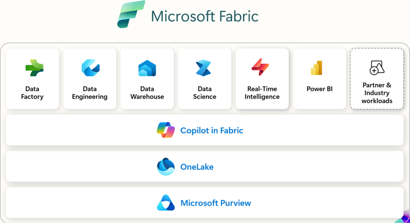

# 0 · Overview

!!! info "Source"
    [0_Overview.md](https://github.com/Cloud2BR-MSFTLearningHub/MS-Fabric-Essentials-Workshop/blob/main/0_Overview.md)

Microsoft Fabric is an all-in-one, SaaS analytics and data platform for enterprises. It unifies new and existing capabilities from **Power BI**, **Azure Synapse Analytics**, and **Azure Data Factory** into one product, spanning:

- **Azure Data** — data engineering and management tools.
- **Azure Analytics** — BI and analytics, especially via Power BI.

## Core components

| Component | Description | Typical use cases |
| --- | --- | --- |
| **Data Factory** | Cloud data integration that orchestrates and automates data movement + transformation. | ETL, data migration, multi-source integration. |
| **Synapse Data Engineering** | Apache Spark for large-scale data prep and transformation. | Big data processing, data preparation. |
| **Synapse Data Warehouse** | Combines big data + warehousing for high-performance SQL analytics. | Data warehousing, large-scale analytics/BI. |
| **Synapse Real-Time Analytics** | Processes streaming data for immediate insights. | Real-time dashboards, alerts, monitoring. |
| **Power BI** | Interactive visualizations and self-service BI. | Reports, dashboards, data visualization. |
| **Data Activator** | Automates responses to data events. | Event-driven automation, real-time alerts. |
| **Synapse Data Science** | Build, train, deploy ML models within Fabric. | Machine learning, model deployment. |
| **Microsoft Purview** | Unified data governance, security, and compliance. | Governance, security, compliance. |

## OneLake & key concepts

- **OneLake** — single, unified data lake for the whole tenant (the "OneDrive for data"). Built on **ADLS Gen2** APIs, so existing ADLS Gen2 tools work.
- **Lakehouse** — combines data lake + warehouse; handles structured *and* unstructured data.
- **Data Warehouse** — centralized store for structured data, optimized for SQL analytics.
- **Parquet & Delta** — open storage formats underpinning Fabric tables.
- **Z-Order & V-Order** — optimizations that speed up reads/queries on Delta tables.
- **Dataflow Gen2 & Data Pipelines** — low-code and orchestrated data movement/transformation.
- **Shortcuts & Mirroring** — reference or sync external data into OneLake *without copying/moving* it (virtual data products).
